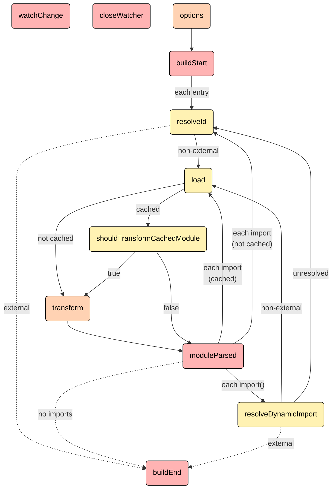
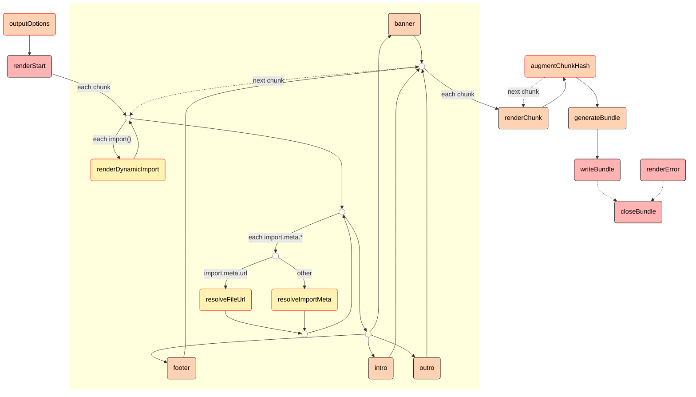

# {{ $frontmatter.title }}

[[toc]]

## 插件概述 {#plugins-overview}

Rollup 插件是一个对象，具有 [属性](#properties)、[构建钩子](#build-hooks) 和 [输出生成钩子](#output-generation-hooks) 中的一个或多个，并遵循我们的 [约定](#conventions)。插件应作为一个导出一个函数的包进行发布，该函数可以使用插件特定的选项进行调用并返回此类对象。

插件允许你通过例如在打包之前进行转译代码或在`node_modules`文件夹中查找第三方模块来自定义 Rollup 的行为。有关如何使用它们的示例，请参见 [使用插件](../tutorial/index.md#using-plugins)。

插件列表可以在 [github.com/rollup/awesome](https://github.com/rollup/awesome) 上找到。如果你想给某个插件提交建议，请提交一个 Pull Request。

## 一个简单的示例 {#a-simple-example}

以下插件将拦截任何不通过访问文件系统的 `virtual-module` 导入。例如，如果你想在浏览器中使用 Rollup，则需要这样做。它甚至可以用来替换入口点，如示例所示。

```js
// rollup-plugin-my-example.js
export default function myExample () {
  return {
    name: 'my-example', // 此名称将出现在警告和错误中
    resolveId ( source ) {
      if (source === 'virtual-module') {
        // 这表示 rollup 不应询问其他插件或
        // 从文件系统检查以找到此 ID
        return source;
      }
      return null; // 其他ID应按通常方式处理
    },
    load ( id ) {
      if (id === 'virtual-module') {
        // "virtual-module"的源代码
        return 'export default "This is virtual!"';
      }
      return null; // 其他ID应按通常方式处理
    }
  };
}

// rollup.config.js
import myExample from './rollup-plugin-my-example.js';
export default ({
  input: 'virtual-module', // 由我们的插件解析
  plugins: [myExample()],
  output: [{
    file: 'bundle.js',
    format: 'es'
  }]
});
```

### 约定 {#conventions}

- 插件应该有一个明确的名称，并以`rollup-plugin-`作为前缀。
- 在`package.json`中包含`rollup-plugin`关键字。
- 插件应该被测试，我们推荐 [mocha](https://github.com/mochajs/mocha) 或 [ava](https://github.com/avajs/ava)，它们支持 Promise。
- 可能的话，使用异步方法，例如 `fs.readFile` 而不是 `fs.readFileSync`
- 用英文文档描述你的插件。
- 确保如果适当，你的插件输出正确的源映射。
- 如果插件使用“虚拟模块”（例如用于辅助函数），请使用`\0`前缀模块 ID。这可以防止其他插件尝试处理它。

## 属性 {#properties}

### name {#name}

|       |          |
| ----: | :------- |
| 类型: | `string` |

插件的名称，用于在警告和错误消息中标识插件。

### version {#version}

|       |          |
| ----: | :------- |
| 类型: | `string` |

插件的版本，用于插件间通信场景。

## 构建钩子 {#build-hooks}

为了与构建过程交互，你的插件对象包括“钩子”。钩子是在构建的各个阶段调用的函数。钩子可以影响构建的运行方式，提供关于构建的信息，或在构建完成后修改构建。有不同种类的钩子：

- `async`：该钩子也可以返回一个解析为相同类型的值的 Promise；否则，该钩子被标记为 `sync`。
- `first`：如果有多个插件实现此钩子，则钩子按顺序运行，直到钩子返回一个不是 `null` 或 `undefined` 的值。
- `sequential`：如果有多个插件实现此钩子，则所有这些钩子将按指定的插件顺序运行。如果钩子是 `async`，则此类后续钩子将等待当前钩子解决后再运行。
- `parallel`：如果有多个插件实现此钩子，则所有这些钩子将按指定的插件顺序运行。如果钩子是 `async`，则此类后续钩子将并行运行，而不是等待当前钩子。

除了函数之外，钩子也可以是对象。在这种情况下，实际的钩子函数（或 `banner/footer/intro/outro` 的值）必须指定为 `handler`。这允许你提供更多的可选属性，以改变钩子的执行：

- `order: "pre" | "post" | null`<br> 如果有多个插件实现此钩子，则可以先运行此插件（`"pre"`），最后运行此插件（`"post"`），或在用户指定的位置运行（没有值或 `null`）。

  ```js
  export default function resolveFirst() {
  	return {
  		name: 'resolve-first',
  		resolveId: {
  			order: 'pre',
  			handler(source) {
  				if (source === 'external') {
  					return { id: source, external: true };
  				}
  				return null;
  			}
  		}
  	};
  }
  ```

  如果有多个插件使用 `"pre"` 或 `"post"`，Rollup 将按用户指定的顺序运行它们。此选项可用于所有插件钩子。对于并行钩子，它会更改同步部分运行的顺序。

- `sequential: boolean`<br> 不要与其他插件的相同钩子并行运行此钩子。仅可用于 `parallel` 钩子。使用此选项将使 Rollup 等待所有先前插件的结果，然后执行插件钩子，然后再次并行运行剩余的插件。例如，当你有插件 `A`、`B`、`C`、`D`、`E`，它们都实现了相同的并行钩子，并且中间插件 `C` 具有 `sequential: true` 时，Rollup 将首先并行运行 `A + B`，然后单独运行 `C`，然后再次并行运行 `D + E`。

  当你需要在不同的 [`writeBundle`](#writebundle) 钩子中运行多个命令行工具并相互依赖时，这可能很有用（请注意，如果可能，建议在顺序 [`generateBundle`](#generatebundle) 钩子中添加/删除文件，这样更快，适用于纯内存构建，并允许其他内存构建插件查看文件）。你可以将此选项与 `order` 结合使用进行排序。

  ```js
  import { resolve } from 'node:path';
  import { readdir } from 'node:fs/promises';

  export default function getFilesOnDisk() {
  	return {
  		name: 'getFilesOnDisk',
  		writeBundle: {
  			sequential: true,
  			order: 'post',
  			async handler({ dir }) {
  				const topLevelFiles = await readdir(resolve(dir));
  				console.log(topLevelFiles);
  			}
  		}
  	};
  }
  ```

构建钩子在构建阶段运行，该阶段由 `rollup.rollup(inputOptions)` 触发。它们主要涉及在 Rollup 处理输入文件之前定位、提供和转换输入文件。构建阶段的第一个钩子是 [`options`](#options)，最后一个钩子始终是 [`buildEnd`](#buildend)。如果有构建错误，则在此之后将调用 [`closeBundle`](#closebundle)。

<style>
.legend-grid {
	display: grid;
	grid-template-columns: max-content max-content;
	grid-column-gap: 16px;
}

.legend-rect {
	display: inline-block;
	width: 16px;
	height: 16px;
	border-radius: 5px;
	border: 1px solid #000;
	vertical-align: middle;
	margin-right: 5px;
	background: #fff;
}
</style>

<div class="legend-grid">
	<div style="grid-column: 1; grid-row: 1">
		<span class="legend-rect" style="background: #ffb3b3"></span>parallel
	</div>
	<div style="grid-column: 1; grid-row: 2">
		<span class="legend-rect" style="background: #ffd2b3"></span>sequential
	</div>
	<div style="grid-column: 1; grid-row: 3">
		<span class="legend-rect" style="background: #fff2b3"></span>first
	</div>
	<div style="grid-column: 2; grid-row: 1">
		<span class="legend-rect" style="border-color: #000"></span>async
	</div>
	<div style="grid-column: 2; grid-row: 2">
		<span class="legend-rect" style="border-color: #f00"></span>sync
	</div>
</div>



此外，在监视模式下，[`watchChange`](#watchchange) 钩子可以在任何时候触发，以通知当前运行生成输出后将触发新的运行。另外，当监视器关闭时，[`closeWatcher`](#closewatcher) 钩子将被触发。

有关在输出生成阶段运行以修改生成的输出的钩子，请参见 [输出生成钩子](#output-generation-hooks)。

### buildEnd

|  |  |
| --: | :-- |
| 类型： | `(error?: Error) => void` |
| 类别： | async, parallel |
| 上一个钩子： | [`moduleParsed`](#moduleparsed)、[`resolveId`](#resolveid) 或 [`resolveDynamicImport`](#resolvedynamicimport) |
| 下一个钩子： | 输出生成阶段的 [`outputOptions`](#outputoptions)，因为这是构建阶段的最后一个钩子 |

在 Rollup 完成产物但尚未调用 `generate` 或 `write` 之前调用；也可以返回一个 Promise。如果在构建过程中发生错误，则将其传递给此钩子。

### buildStart

|              |                                                |
| -----------: | :--------------------------------------------- |
|       类型： | `(options: InputOptions) => void`              |
|       类别： | async, parallel                                |
| 上一个钩子： | [`options`](#options)                          |
| 下一个钩子： | 并行解析每个入口点的 [`resolveId`](#resolveid) |

在每个 `rollup.rollup` 构建上调用。当你需要访问传递给 `rollup.rollup()` 的选项时，建议使用此钩子，因为它考虑了所有 [`options`](#options) 钩子的转换，并且还包含未设置选项的正确默认值。

### closeWatcher

|  |  |
| --: | :-- |
| 类型： | `() => void` |
| 类别： | async, parallel |
| 上一个/下一个钩子： | 此钩子可以在构建和输出生成阶段的任何时候触发。如果是这种情况，则当前构建仍将继续，但永远不会触发新的 [`watchChange`](#watchchange) 事件 |

在观察器进程即将关闭时通知插件，以便可以关闭所有打开的资源。如果返回一个 Promise，则 Rollup 将在关闭进程之前等待 Promise 解决。输出插件无法使用此钩子。

### load

|  |  |
| --: | :-- |
| 类型： | `(id: string) => LoadResult` |
| 类别： | async, first |
| 上一个钩子： | 已解析加载的 id 的 [`resolveId`](#resolveid) 或 [`resolveDynamicImport`](#resolvedynamicimport)。此外，此钩子可以通过调用 [`this.load`](#this-load) 来从插件钩子中的任何位置触发预加载与 id 对应的模块 |
| 下一个钩子： | 如果未使用缓存，或者没有具有相同 `code` 的缓存副本，则为 [`transform`](#transform)，否则为 [`shouldTransformCachedModule`](#shouldtransformcachedmodule) |

```typescript
type LoadResult = string | null | SourceDescription;

interface SourceDescription {
	code: string;
	map?: string | SourceMap;
	ast?: ESTree.Program;
	attributes?: { [key: string]: string } | null;
	meta?: { [plugin: string]: any } | null;
	moduleSideEffects?: boolean | 'no-treeshake' | null;
	syntheticNamedExports?: boolean | string | null;
}
```

定义一个自定义加载器。返回 `null` 将推迟到其他 `load` 函数（最终是从文件系统加载的默认行为）。为了防止在某些情况下（例如，此钩子已经使用 [`this.parse`](#this-parse) 生成了 AST）产生额外的解析开销，此钩子可以选择返回一个 `{ code, ast, map }` 对象。`ast` 必须是一个标准的 ESTree AST，每个节点都有 `start` 和 `end` 属性。如果转换不移动代码，则可以通过将 `map` 设置为 `null` 来保留现有的源映射。否则，你可能需要生成源映射。请参阅 [源代码转换](#source-code-transformations) 部分。

如果 `moduleSideEffects` 返回 `false`，并且没有其他模块从该模块导入任何内容，则即使该模块具有副作用，该模块也不会包含在产物中。如果返回 `true`，则 Rollup 将使用其默认算法包含模块中具有副作用的所有语句（例如修改全局或导出变量）。如果返回 `"no-treeshake"`，则将关闭此模块的除屑优化，并且即使该模块为空，也将在生成的块之一中包含它。如果返回 `null` 或省略标志，则 `moduleSideEffects` 将由第一个解析此模块的 `resolveId` 钩子，[`treeshake.moduleSideEffects`](../configuration-options/index.md#treeshake-modulesideeffects) 选项或最终默认为 `true` 确定。`transform` 钩子可以覆盖此设置。

<<<<<<< HEAD
`attributes` 包含导入此模块时使用的导入属性。目前，它们不会影响产物模块的呈现，而是用于文档目的。如果返回 `null` 或省略标志，则 `attributes` 将由第一个解析此模块的 `resolveId` 钩子或此模块的第一个导入中存在的断言确定。`transform` 钩子可以覆盖此设置。
=======
`attributes` contain the import attributes that were used when this module was imported. At the moment, they do not influence rendering for bundled modules but rather serve documentation purposes. If `null` is returned or the flag is omitted, then `attributes` will be determined by the first `resolveId` hook that resolved this module, or the attributes present in the first import of this module. The `transform` hook can override this.
>>>>>>> 7f9d85c7bea77f83dc1abf9ea4ed1046e9875ef5

有关 `syntheticNamedExports` 选项的影响，请参见 [合成命名导出](#synthetic-named-exports)。如果返回 `null` 或省略标志，则 `syntheticNamedExports` 将由第一个解析此模块的 `resolveId` 钩子确定，或者最终默认为 `false`。`transform` 钩子可以覆盖此设置。

有关如何使用 `meta` 选项的 [自定义模块元数据](#custom-module-meta-data)。如果此钩子返回 `meta` 对象，则该对象将与 `resolveId` 钩子返回的任何 `meta` 对象浅合并。如果没有钩子返回 `meta` 对象，则默认为一个空对象。`transform` 钩子可以进一步添加或替换该对象的属性。

<<<<<<< HEAD
你可以使用 [`this.getModuleInfo`](#this-getmoduleinfo) 在此钩子中查找 `assertions`、`meta`、`moduleSideEffects` 和 `syntheticNamedExports` 的先前值。
=======
You can use [`this.getModuleInfo`](#this-getmoduleinfo) to find out the previous values of `attributes`, `meta`, `moduleSideEffects` and `syntheticNamedExports` inside this hook.
>>>>>>> 7f9d85c7bea77f83dc1abf9ea4ed1046e9875ef5

### moduleParsed

|  |  |
| --: | :-- |
| 类型： | `(moduleInfo: ModuleInfo) => void` |
| 类别： | async，parallel |
| 上一个钩子： | [`transform`](#transform)，当前处理的文件已被转换 |
| 下一个钩子： | [`resolveId`](#resolveid) 和 [`resolveDynamicImport`](#resolvedynamicimport)，并行解析所有已发现的静态和动态导入，如果存在，否则调用 [`buildEnd`](#buildend)。 |

每次 Rollup 完全解析一个模块时，都会调用此钩子。有关传递给此钩子的信息，请参见 [`this.getModuleInfo`](#this-getmoduleinfo)。

与 [`transform`](#transform) 钩子不同，此钩子永远不会被缓存，可以用于获取有关缓存和其他模块的信息，包括 `meta` 属性的最终形状、`code` 和 `ast`。

此钩子将等待直到所有导入都已解析，以便 `moduleInfo.importedIds`、`moduleInfo.dynamicallyImportedIds`、`moduleInfo.importedIdResolutions` 和 `moduleInfo.dynamicallyImportedIdResolutions` 中的信息是完整且准确的。但是请注意，有关导入模块的信息可能不完整，因为可能稍后会发现其他导入者。如果需要此信息，请使用 [`buildEnd`](#buildend) 钩子。

### onLog

|                |                                                        |
| -------------: | :----------------------------------------------------- |
|          类型： | `(level: LogLevel, log: RollupLog) => boolean \| null` |
|          类别： | sync, sequential                                       |
| 上一个/下一个钩子： | 此钩子可以在任何时候触发。                |

请参阅 [`onLog`](../configuration-options/index.md#onlog) 选项以了解可用的 `Loglevel` 值和 `RollupLog` 类型。

此钩子是一个函数，它接收并过滤由 Rollup 和插件生成的日志和警告，然后将它们传递给 [`onLog`](../configuration-options/index.md#onlog) 选项或打印到控制台。

如果此钩子返回 `false`，日志将会被过滤。否则，日志将会传递给下一个插件的 `onLog` 钩子、`onLog` 选项或打印到控制台。插件还可以通过将日志传递给 [`this.error`](#this-error)、[`this.warn`](#this-warn)、[`this.info`](#this-info) 或 [`this.debug`](#this-debug) 并返回 `false` 来改变日志的级别或将日志转换为报错。请注意，与其他插件钩子不同，这些函数不会添加或更改日志的属性，例如插件名称。另外，由 `onLog` 钩子生成的日志不会再次传递给同一个插件的 `onLog` 钩子。如果另一个插件在其自己的 `onLog` 钩子中对这样的日志做出响应并生成了另一个日志，那么这个日志也不会传递给原始的 `onLog` 钩子。

```js
function plugin1() {
	return {
		name: 'plugin1',
		buildStart() {
			this.info({ message: 'Hey', pluginCode: 'SPECIAL_CODE' });
		},
		onLog(level, log) {
			if (log.plugin === 'plugin1' && log.pluginCode === 'SPECIAL_CODE') {
				// 我们根据 code 将日志转换为警告。这些警告
				// 不会被传递回同一个插件，以避免无限循环，
				// 但其他插件仍然会接收到。
				this.warn(log);
				return false;
			}
		}
	};
}

function plugin2() {
	return {
		name: 'plugin2',
		onLog(level, log) {
			if (log.plugin === 'plugin1' && log.pluginCode === 'SPECIAL_CODE') {
				// 你也可以在这个钩子中修改日志
				log.meta = 'processed by plugin 2';
				// 这会把日志转换回“info”级别。如果这是对
				// 第一个插件的响应，为了避免无限循环，它将
				// 不会被传递回之前的插件。如果两个插件都处于
				// 激活状态，并且第二个插件位于第一个插件之后，
				// 则该日志将成为一个 info 级别的日志
				this.info(log);
				return false;
			}
		}
	};
}
```

与 [`options`](#options) 钩子类似，这个钩子没有访问大多数 [插件上下文](#plugin-context) 工具函数的权限，因为它可能在 Rollup 完全配置之前运行。唯一支持的属性是 [`this.meta`](#this-meta)，以及用于打印日志和报错的 [`this.error`](#this-error)、[`this.warn`](#this-warn)、[`this.info`](#this-info) 和 [`this.debug`](#this-debug)。

### options

|             |                                                   |
| ----------: | :------------------------------------------------ |
|       类型: | `(options: InputOptions) => InputOptions \| null` |
|       类别: | async，sequential                                 |
| 上一个钩子: | 这是构建阶段的第一个钩子                          |
| 下一个钩子: | [`buildStart`](#buildstart)                       |

替换或操作传递给 `rollup.rollup` 的选项对象。返回 `null` 不会替换任何内容。如果只需要读取选项，则建议使用 [`buildStart`](#buildstart) 钩子，因为该钩子可以访问所有 `options` 钩子的转换考虑后的选项。

如 [`onLog`](#onlog) 钩子一样，此钩子不具有大多数 [插件上下文](#plugin-context) 实用程序函数的访问权限，因为它可能在 Rollup 完全配置之前运行。唯一支持的属性是 [`this.meta`](#this-meta) 以及 [`this.error`](#this-error)、[`this.warn`](#this-warn)、[`this.info`](#this-info) 和 [`this.debug`](#this-debug) 用于记录和错误。

### resolveDynamicImport

|  |  |
| --- | --- |
| 类型： | `ResolveDynamicImportHook` |
| 类别： | async, first |
| 上一个钩子： | 导入文件的 [`moduleParsed`](#moduleparsed) 钩子 |
| 下一个钩子： | 如果钩子解析出尚未加载的 id，则为 [`load`](#load)，如果动态导入包含字符串并且未被钩子解析，则为 [`resolveId`](#resolveid)，否则为 [`buildEnd`](#buildend) |

```typescript
type ResolveDynamicImportHook = (
	specifier: string | AstNode,
	importer: string,
	options: { attributes: Record<string, string> }
) => ResolveIdResult;
```

::: tip

返回类型 **ResolveIdResult** 与 [`resolveId`](#resolveid) 钩子相同。

:::

为动态导入定义自定义解析器。返回 `false` 表示应将导入保留，不要传递给其他解析器，从而使其成为外部导入。与 [`resolveId`](#resolveid) 钩子类似，你还可以返回一个对象，将导入解析为不同的 id，同时将其标记为外部导入。

<<<<<<< HEAD
`assertions` 告诉你导入中存在哪些导入断言。即 `import("foo", {assert: {type: "json"}})` 将传递 `assertions: {type: "json"}`。
=======
`attributes` tells you which import attributes were present in the import. I.e. `import("foo", {assert: {type: "json"}})` will pass along `attributes: {type: "json"}`.
>>>>>>> 7f9d85c7bea77f83dc1abf9ea4ed1046e9875ef5

如果动态导入作为字符串参数传递，则从此钩子返回的字符串将被解释为现有模块 id，而返回 `null` 将推迟到其他解析器，最终到达 `resolveId`。

如果动态导入未传递字符串作为参数，则此钩子可以访问原始 AST 节点以进行分析，并以以下方式略有不同：

- 如果所有插件都返回 `null`，则将导入视为 `external`，而不会产出警告。
- 如果返回字符串，则此字符串不会被解释为模块 id，而是用作导入参数的替换。插件有责任确保生成的代码有效。
- 要将此类导入解析为现有模块，仍然可以返回对象 `{id，external}`。

请注意，此钩子的返回值不会传递给 `resolveId`；如果需要访问静态解析算法，则可以在插件上下文中使用 [`this.resolve(source, importer)`](#this-resolve)。

### resolveId

|  |  |
| --: | :-- |
| 类型: | `ResolveIdHook` |
| 类别: | async, first |
| 上一个钩子: | 如果我们正在解析入口点，则为 [`buildStart`](#buildstart)，如果我们正在解析导入，则为 [`moduleParsed`](#moduleparsed)，否则作为 [`resolveDynamicImport`](#resolvedynamicimport) 的后备。此外，此钩子可以通过调用 [`this.emitFile`](#this-emitfile) 来在构建阶段的插件钩子中触发以产出入口点，或随时调用 [`this.resolve`](#this-resolve) 手动解析 id。 |
| 下一个钩子: | 如果尚未加载解析的 id，则为 [`load`](#load)，否则为 [`buildEnd`](#buildend)。 |

```typescript
type ResolveIdHook = (
	source: string,
	importer: string | undefined,
	options: {
		attributes: Record<string, string>;
		custom?: { [plugin: string]: any };
		isEntry: boolean;
	}
) => ResolveIdResult;

type ResolveIdResult = string | null | false | PartialResolvedId;

interface PartialResolvedId {
	id: string;
	external?: boolean | 'absolute' | 'relative';
	attributes?: Record<string, string> | null;
	meta?: { [plugin: string]: any } | null;
	moduleSideEffects?: boolean | 'no-treeshake' | null;
	resolvedBy?: string | null;
	syntheticNamedExports?: boolean | string | null;
}
```

定义一个自定义解析器。解析器可以用于定位第三方依赖项等。这里的 `source` 就是导入语句中的导入目标，例如：

```js
import { foo } from '../bar.js';
```

这个 source就是 `"../bar.js"`.

`importer` 是导入模块的解析完全后的 id。在解析入口点时，`importer` 通常为 `undefined`。这里的一个例外是通过 [`this.emitFile`](#this-emitfile) 生成的入口点，这里可以提供一个 `importer` 参数。

对于这些情况，`isEntry` 选项将告诉你我们正在解析用户定义的入口点、已产出的块，还是是否为 [`this.resolve`](#this-resolve) 上下文函数提供了 `isEntry` 参数。

例如，你可以将其用作为入口点定义自定义代理模块的机制。以下插件将所有入口点代理到注入 polyfill 导入的模块中。

```js
// 我们在 polyfill id 前面加上 \0，
// 以告诉其他插件不要尝试加载或转换它
const POLYFILL_ID = '\0polyfill';
const PROXY_SUFFIX = '?inject-polyfill-proxy';

function injectPolyfillPlugin() {
	return {
		name: 'inject-polyfill',
		async resolveId(source, importer, options) {
			if (source === POLYFILL_ID) {
				// 对于polyfill，必须始终考虑副作用
				// 否则使用
				// "treeshake.moduleSideEffects: false"
				// 这样可能会阻止包含polyfill
				return { id: POLYFILL_ID, moduleSideEffects: true };
			}
			if (options.isEntry) {
				// 决定实际的入口点是什么。
				const resolution = await this.resolve(source, importer, options);
				// 如果它不能被解析或是外部的，就返回它
				// 这样 Rollup 就可以显示一个错误
				if (!resolution || resolution.external) return resolution;
				// 在代理的加载钩子中，我们需要知道入口点是否有默认导出。
				// 然而，我们不再拥有完整的“resolution”对象，
				// 该对象可能包含来自其他插件的元数据，
				// 这些元数据仅在第一次加载时添加。
				// 因此，我们在此处触发加载
				const moduleInfo = await this.load(resolution);
				// 我们需要确保原始入口点中的副作用
				// 即使对于 treeshake.moduleSideEffects: false
				// 也要被考虑。
				// “moduleSideEffects”是 ModuleInfo 上的可写属性。
				moduleInfo.moduleSideEffects = true;
				// 重要的是，新的入口点不以 \0 开头
				// 并且与原始入口点具有相同的目录
				// 以避免破坏相对外部引用的生成。
				// 同时保留名称并仅在末尾添加一个“?query”
				// 确保 preserveModules
				// 为此入口点生成原始入口点名称。
				return `${resolution.id}${PROXY_SUFFIX}`;
			}
			return null;
		},
		load(id) {
			if (id === POLYFILL_ID) {
				// 用实际的 polyfill 替换
				return "console.log('polyfill');";
			}
			if (id.endsWith(PROXY_SUFFIX)) {
				const entryId = id.slice(0, -PROXY_SUFFIX.length);
				// 我们知道 ModuleInfo.hasDefaultExport 是可靠的
				// 因为我们在 resolveId 中等待了 this.load
				const { hasDefaultExport } = this.getModuleInfo(entryId);
				let code =
					`import ${JSON.stringify(POLYFILL_ID)};` +
					`export * from ${JSON.stringify(entryId)};`;
				// 命名空间重新导出不会重新导出默认值
				// 因此我们需要特殊处理
				if (hasDefaultExport) {
					code += `export { default } from ${JSON.stringify(entryId)};`;
				}
				return code;
			}
			return null;
		}
	};
}
```

<<<<<<< HEAD
`attributes` 参数告诉你导入中存在哪些导入属性。例如，`import "foo" assert {type: "json"}` 将传递 `attributes: {type: "json}"`。
=======
`attributes` tells you which import attributes were present in the import. I.e. `import "foo" assert {type: "json"}` will pass along `attributes: {type: "json"}`.
>>>>>>> 7f9d85c7bea77f83dc1abf9ea4ed1046e9875ef5

如果返回 `null`，则会转而使用其他 `resolveId` 函数，最终使用默认的解析行为。如果返回 `false`，则表示 `source` 应被视为外部模块，不包含在产物中。如果这发生在相对导入中，则会像使用 `external` 选项时一样重新规范化 id。

如果返回一个对象，则可以将导入解析为不同的 id，同时将其从产物中排除。这使你可以将依赖项替换为外部依赖项，而无需用户手动通过 `external` 选项将它们挪到产物“之外” ：

```js
function externalizeDependencyPlugin() {
	return {
		name: 'externalize-dependency',
		resolveId(source) {
			if (source === 'my-dependency') {
				return { id: 'my-dependency-develop', external: true };
			}
			return null;
		}
	};
}
```

如果 `external` 为 `true`，则绝对 id 将根据用户对 [`makeAbsoluteExternalsRelative`](../configuration-options/index.md#makeabsoluteexternalsrelative) 选项的选择转换为相对 id。可以通过传递 `external: "relative"` 来覆盖此选择，以始终将绝对 id 转换为相对 id，或者传递 `external: "absolute"` 来保持其为绝对 id。当返回一个对象时，相对的外部 id，即以 `./` 或 `../` 开头的 id，将 _不会_ 被内部转换为绝对 id 并在输出中转换回相对 id，而是不变地包含在输出中。如果你希望相对 id 被重新规范化和去重，请将绝对文件系统位置作为 `id` 返回，并选择 `external: "relative"`。

如果在解析模块 id 的第一个钩子中返回 `false` 且没有其他模块从此模块导入任何内容，则即使该模块具有副作用，该模块也不会被包含。如果返回 `true`，Rollup 将使用其默认算法来包含模块中具有副作用的所有语句（例如修改全局或导出变量）。如果返回 `"no-treeshake"`，则将关闭此模块的除屑，并且即使它为空，它也将包含在生成的块之一中。如果返回 `null` 或省略标志，则 `moduleSideEffects` 将由 [`treeshake.moduleSideEffects`](../configuration-options/index.md#treeshake-modulesideeffects) 选项确定或默认为 `true`。`load` 和 `transform` 钩子可以覆盖此选项。

可以在返回的对象中明确声明 `resolvedBy`。它将替换 [`this.resolve`](#this-resolve) 返回的相应字段。

<<<<<<< HEAD
如果为外部模块返回 `attributes` 的值，则这将确定在生成 `"es"` 输出时如何呈现此模块的导入。例如，`{id: "foo", external: true, attributes: {type: "json"}}` 将导致此模块的导入显示为 `import "foo" assert {type: "json"}`。如果不传递值，则将使用 `attributes` 输入参数的值。传递一个空对象以删除任何断言。虽然 `attributes` 不影响产物模块的呈现，但它们仍然需要在模块的所有导入中保持一致，否则会产出警告。`load` 和 `transform` 钩子可以覆盖此选项。
=======
If you return a value for `attributes` for an external module, this will determine how imports of this module will be rendered when generating `"es"` output. E.g. `{id: "foo", external: true, attributes: {type: "json"}}` will cause imports of this module appear as `import "foo" assert {type: "json"}`. If you do not pass a value, the value of the `attributes` input parameter will be used. Pass an empty object to remove any attributes. While `attributes` do not influence rendering for bundled modules, they still need to be consistent across all imports of a module, otherwise a warning is emitted. The `load` and `transform` hooks can override this.
>>>>>>> 7f9d85c7bea77f83dc1abf9ea4ed1046e9875ef5

有关 `syntheticNamedExports` 选项的影响，请参见 [synthetic named exports](#synthetic-named-exports)。如果返回 `null` 或省略标志，则 `syntheticNamedExports` 将默认为 `false`。`load` 和 `transform` 钩子可以覆盖此选项。

有关如何使用 `meta` 选项，请参见 [custom module meta-data](#custom-module-meta-data)。如果返回 `null` 或省略选项，则 `meta` 将默认为空对象。`load` 和 `transform` 钩子可以添加或替换此对象的属性。

<<<<<<< HEAD
请注意，虽然 `resolveId` 将为模块的每个导入调用一次，并且因此可以多次解析为相同的 `id`，但是 `external`、`attributes`、`meta`、`moduleSideEffects` 或 `syntheticNamedExports` 的值只能在加载模块之前设置一次。原因是在此调用之后，Rollup 将继续使用该模块的 [`load`](#load) 和 [`transform`](#transform) 钩子，这些钩子可能会覆盖这些值，并且如果它们这样做，则应优先考虑。
=======
Note that while `resolveId` will be called for each import of a module and can therefore resolve to the same `id` many times, values for `external`, `attributes`, `meta`, `moduleSideEffects` or `syntheticNamedExports` can only be set once before the module is loaded. The reason is that after this call, Rollup will continue with the [`load`](#load) and [`transform`](#transform) hooks for that module that may override these values and should take precedence if they do so.
>>>>>>> 7f9d85c7bea77f83dc1abf9ea4ed1046e9875ef5

当通过 [`this.resolve`](#this-resolve) 从插件触发此钩子时，可以向此钩子传递自定义选项对象。虽然此对象将不被修改，但插件应遵循添加具有对象的 `custom` 属性的约定，其中键对应于选项所针对的插件的名称。有关详细信息，请参见 [custom resolver options](#custom-resolver-options)。

在观察模式下或者明确使用缓存时，缓存模块的已解析导入也会从缓存中获取，而不是再次通过 `resolveId` 钩子进行确定。为了防止这种情况，你可以在 [`shouldTransformCachedModule`](#shouldtransformcachedmodule) 钩子中为该模块返回 `true`。这将从缓存中删除该模块及其导入解析，并再次调用 `transform` 和 `resolveId`。

### shouldTransformCachedModule

|  |  |
| --: | :-- |
| 类型: | `ShouldTransformCachedModuleHook` |
| 类别: | async, first |
| 上一个钩子: | [`load`](#load)，用于加载缓存文件并将其代码与缓存版本进行比较 |
| 下一个钩子: | 如果没有插件返回 `true`，则为 [`moduleParsed`](#moduleparsed)，否则为 [`transform`](#transform) |

```typescript
type ShouldTransformCachedModuleHook = (options: {
	ast: AstNode;
	code: string;
	id: string;
	meta: { [plugin: string]: any };
	moduleSideEffects: boolean | 'no-treeshake';
	syntheticNamedExports: boolean | string;
}) => boolean | NullValue;
```

如果使用 Rollup 缓存（例如在观察模式下或通过 JavaScript API 明确使用），如果在 [`load`](#transform) 钩子之后，加载的 `code` 与缓存副本的代码相同，则 Rollup 将跳过模块的 [`transform`](#transform) 钩子。为了防止这种情况，插件可以实现此钩子并返回 `true`，以丢弃缓存副本并转换模块。

此钩子还可用于查找已缓存的模块并访问其缓存的元信息。

如果插件没有返回布尔值，则 Rollup 将为其他插件触发此钩子，否则所有剩余的插件都将被跳过。

### transform

|  |  |
| --: | :-- |
| 类型: | `(code: string, id: string) => TransformResult` |
| 类别: | async, sequential |
| 上一个钩子: | [`load`](#load)，用于加载当前处理的文件。如果使用缓存并且该模块有一个缓存副本，则为 [`shouldTransformCachedModule`](#shouldtransformcachedmodule)，如果插件为该钩子返回了 `true` |
| 下一个钩子: | [`moduleParsed`](#moduleparsed)，一旦文件已被处理和解析 |

```typescript
type TransformResult = string | null | Partial<SourceDescription>;

interface SourceDescription {
	code: string;
	map?: string | SourceMap;
	ast?: ESTree.Program;
	attributes?: { [key: string]: string } | null;
	meta?: { [plugin: string]: any } | null;
	moduleSideEffects?: boolean | 'no-treeshake' | null;
	syntheticNamedExports?: boolean | string | null;
}
```

可以被用来转换单个模块。为了防止额外的解析开销，例如，这个钩子已经使用 [`this.parse`](#this-parse) 生成了一个 AST，这个钩子可以选择返回一个 `{ code, ast, map }` 对象。`ast` 必须是一个标准的 ESTree AST，每个节点都有 `start` 和 `end` 属性。如果转换不移动代码，你可以通过将 `map` 设置为 `null` 来保留现有的 sourcemaps。否则，你可能需要生成源映射。请参阅 [源代码转换](#source-code-transformations) 部分。

请注意，在观察模式下或明确使用缓存时，当重新构建时，此钩子的结果会被缓存，仅当模块的 `code` 发生更改或上次触发此钩子时添加了通过 `this.addWatchFile` 添加的文件时，才会再次触发该模块的钩子。

在所有其他情况下，将触发 [`shouldTransformCachedModule`](#shouldtransformcachedmodule) 钩子，该钩子可以访问缓存的模块。从 `shouldTransformCachedModule` 返回 `true` 将从缓存中删除该模块，并再次调用 `transform`。

你还可以使用返回值的对象形式来配置模块的其他属性。请注意，可能只返回属性而没有代码转换。

如果对于 `moduleSideEffects` 返回 `false`，并且没有其他模块从该模块导入任何内容，则即使该模块具有副作用，该模块也不会被包含。

如果返回 `true`，则 Rollup 将使用其默认算法，包括模块中具有副作用的所有语句（例如修改全局或导出变量）。

如果返回 `"no-treeshake"`，则将关闭此模块的除屑优化，并且即使为空，它也将包含在生成的块之一中。

如果返回 `null` 或省略标志，则 `moduleSideEffects` 将由加载此模块的 `load` 钩子、解析此模块的第一个 `resolveId` 钩子、[`treeshake.moduleSideEffects`](../configuration-options/index.md#treeshake-modulesideeffects) 选项或最终默认为 `true` 确定。

<<<<<<< HEAD
`assertions` 包含导入此模块时使用的导入断言。目前，它们不会影响产物模块的呈现，而是用于文档目的。如果返回 `null` 或省略标志，则 `assertions` 将由加载此模块的 `load` 钩子、解析此模块的第一个 `resolveId` 钩子或此模块的第一个导入中存在的断言确定。
=======
`attributes` contain the import attributes that were used when this module was imported. At the moment, they do not influence rendering for bundled modules but rather serve documentation purposes. If `null` is returned or the flag is omitted, then `attributes` will be determined by the `load` hook that loaded this module, the first `resolveId` hook that resolved this module, or the attributes present in the first import of this module.
>>>>>>> 7f9d85c7bea77f83dc1abf9ea4ed1046e9875ef5

有关 `syntheticNamedExports` 选项的影响，请参见 [合成命名导出](#synthetic-named-exports)。如果返回 `null` 或省略标志，则 `syntheticNamedExports` 将由加载此模块的 `load` 钩子、解析此模块的第一个 `resolveId` 钩子、[`treeshake.moduleSideEffects`](../configuration-options/index.md#treeshake-modulesideeffects) 选项或最终默认为 `false` 确定。

有关如何使用 `meta` 选项，请参见 [自定义模块元数据](#custom-module-meta-data)。如果返回 `null` 或省略选项，则 `meta` 将由加载此模块的 `load` 钩子、解析此模块的第一个 `resolveId` 钩子或最终默认为空对象确定。

<<<<<<< HEAD
你可以使用 [`this.getModuleInfo`](#this-getmoduleinfo) 在此钩子中查找 `assertions`、`meta`、`moduleSideEffects` 和 `syntheticNamedExports` 的先前值。
=======
You can use [`this.getModuleInfo`](#this-getmoduleinfo) to find out the previous values of `attributes`, `meta`, `moduleSideEffects` and `syntheticNamedExports` inside this hook.
>>>>>>> 7f9d85c7bea77f83dc1abf9ea4ed1046e9875ef5

### watchChange

|  |  |
| --: | :-- |
| 类型: | `watchChange: (id: string, change: {event: 'create' \| 'update' \| 'delete'}) => void` |
| 类别: | async, parallel |
| 上一个/下一个钩子: | 此钩子可以在构建和输出生成阶段的任何时候触发。如果是这种情况，则当前构建仍将继续，但会安排一个新的构建在当前构建完成后开始，从 [`options`](#options) 开始 |

在 `--watch` 模式下，每当 Rollup 检测到监视文件的更改时，就会通知插件。如果返回一个 Promise，则 Rollup 将等待 Promise 解析后再安排另一个构建。此钩子不能由输出插件使用。第二个参数包含更改事件的其他详细信息。

## 输出生成钩子 {#output-generation-hooks}

输出生成钩子可以提供有关生成的产物的信息并在构建完成后修改构建。它们的工作方式和类型与 [构建钩子](#build-hooks) 相同，但是对于每个调用 `bundle.generate(outputOptions)` 或 `bundle.write(outputOptions)`，它们都会单独调用。仅使用输出生成钩子的插件也可以通过输出选项传递，并且因此仅针对某些输出运行。

输出生成阶段的第一个钩子是 [`outputOptions`](#outputoptions)，最后一个钩子是 [`generateBundle`](#generatebundle)（如果通过 `bundle.generate(...)` 成功生成输出），[`writeBundle`](#writebundle)（如果通过 `bundle.write(...)` 成功生成输出），或 [`renderError`](#rendererror)（如果在输出生成期间的任何时候发生错误）。

<div class="legend-grid">
	<div style="grid-column: 1; grid-row: 1">
		<span class="legend-rect" style="background: #ffb3b3"></span>parallel
	</div>
	<div style="grid-column: 1; grid-row: 2">
		<span class="legend-rect" style="background: #ffd2b3"></span>sequential
	</div>
	<div style="grid-column: 1; grid-row: 3">
		<span class="legend-rect" style="background: #fff2b3"></span>first
	</div>
	<div style="grid-column: 2; grid-row: 1">
		<span class="legend-rect" style="border-color: #000"></span>async
	</div>
	<div style="grid-column: 2; grid-row: 2">
		<span class="legend-rect" style="border-color: #f00"></span>sync
	</div>
</div>



此外，[`closeBundle`](#closebundle) 可以作为最后一个钩子调用，但是用户有责任手动调用 [`bundle.close()`](../javascript-api/index.md#rollup-rollup) 来触发此操作。CLI 将始终确保这一点。

### augmentChunkHash

|  |  |
| --: | :-- |
| 类型: | `(chunkInfo: ChunkInfo) => string` |
| 类别: | sync, sequential |
| 上一个钩子: | [`renderChunk`](#renderchunk) |
| 下一个钩子: | 如果还有其他需要处理的块，则为 [`renderChunk`](#renderchunk)，否则为 [`generateBundle`](#generatebundle) |

可用于增加单个块的哈希值。为每个 Rollup 输出块调用。返回 falsy 值不会修改哈希值。Truthy 值将传递给 [`hash.update`](https://nodejs.org/dist/latest-v12.x/docs/api/crypto.html#crypto_hash_update_data_inputencoding)。`chunkInfo` 是 [`generateBundle`](#generatebundle) 中的版本的简化版本，不包括 `code` 和 `map`，并在文件名中使用哈希的占位符。

以下插件将使用当前时间戳使块 `foo` 的哈希无效：

```js
function augmentWithDatePlugin() {
	return {
		name: 'augment-with-date',
		augmentChunkHash(chunkInfo) {
			if (chunkInfo.name === 'foo') {
				return Date.now().toString();
			}
		}
	};
}
```

### banner

|  |  |
| --: | :-- |
| 类型: | `string \| ((chunk: ChunkInfo) => string)` |
| 类别: | async, sequential |
| 上一个钩子: | [`resolveFileUrl`](#resolvefileurl) 用于每个 `import.meta.ROLLUP_FILE_URL_referenceId` 的使用和 [`resolveImportMeta`](#resolveimportmeta) 用于当前块中所有其他 `import.meta` 访问 |
| 下一个钩子: | 如果有下一个块中的动态导入表达式，则为 [`renderDynamicImport`](#renderdynamicimport)，否则为第一个块的 [`renderChunk`](#renderchunk) |

参见 [`output.banner/output.footer`](../configuration-options/index.md#output-banner-output-footer)。

### closeBundle

|  |  |
| --: | :-- |
| 类型: | `closeBundle: () => Promise<void> \| void` |
| 类别: | async，parallel |
| 上一个钩子: | 如果有构建错误，则为 [`buildEnd`](#buildend)，否则为调用 [`bundle.close()`](../javascript-api/index.md#rollup-rollup)，在这种情况下，这将是最后一个触发的钩子 |

可用于清理可能正在运行的任何外部服务。Rollup 的 CLI 将确保在每次运行后调用此钩子，但是 JavaScript API 的用户有责任在生成产物后手动调用 `bundle.close()`。因此，任何依赖此功能的插件都应在其文档中仔细提到这一点。

如果插件想要在监视模式下保留资源，则可以在此钩子中检查 [`this.meta.watchMode`](#this-meta) 并在 [`closeWatcher`](#closewatcher) 中执行必要的监视模式清理。

### footer

|  |  |
| --: | :-- |
| 类型: | `string \| ((chunk: ChunkInfo) => string)` |
| 类别: | async, sequential |
| 上一个钩子: | [`resolveFileUrl`](#resolvefileurl) 用于每个 `import.meta.ROLLUP_FILE_URL_referenceId` 的使用和 [`resolveImportMeta`](#resolveimportmeta) 用于当前块中所有其他 `import.meta` 访问 |
| 下一个钩子: | 如果有下一个块中的动态导入表达式，则为 [`renderDynamicImport`](#renderdynamicimport)，否则为第一个块的 [`renderChunk`](#renderchunk) |

参见 [`output.banner/output.footer`](../configuration-options/index.md#output-banner-output-footer)。

### generateBundle

|  |  |
| --: | :-- |
<<<<<<< HEAD
| 类型: | `(options: OutputOptions, bundle: { [fileName: string]: AssetInfo \| ChunkInfo }, isWrite: boolean) => void` |
| 类别: | async, sequential |
| 上一个钩子: | [`augmentChunkHash`](#augmentchunkhash) |
| 下一个钩子: | 如果输出是通过 `bundle.write(...)` 生成的，则为 [`writeBundle`](#writebundle)，否则这是输出生成阶段的最后一个钩子，并且可能再次跟随 [`outputOptions`](#outputoptions)，如果生成了另一个输出。 |
=======
| Type: | `(options: OutputOptions, bundle: { [fileName: string]: OutputAsset \| OutputChunk }, isWrite: boolean) => void` |
| Kind: | async, sequential |
| Previous: | [`augmentChunkHash`](#augmentchunkhash) |
| Next: | [`writeBundle`](#writebundle) if the output was generated via `bundle.write(...)`, otherwise this is the last hook of the output generation phase and may again be followed by [`outputOptions`](#outputoptions) if another output is generated |
>>>>>>> 7f9d85c7bea77f83dc1abf9ea4ed1046e9875ef5

```typescript
interface OutputAsset {
	fileName: string;
	name?: string;
	needsCodeReference: boolean;
	source: string | Uint8Array;
	type: 'asset';
}

interface OutputChunk {
	code: string;
	dynamicImports: string[];
	exports: string[];
	facadeModuleId: string | null;
	fileName: string;
	implicitlyLoadedBefore: string[];
	imports: string[];
	importedBindings: { [imported: string]: string[] };
	isDynamicEntry: boolean;
	isEntry: boolean;
	isImplicitEntry: boolean;
	map: SourceMap | null;
	modules: {
		[id: string]: {
			renderedExports: string[];
			removedExports: string[];
			renderedLength: number;
			originalLength: number;
			code: string | null;
		};
	};
	moduleIds: string[];
	name: string;
	preliminaryFileName: string;
	referencedFiles: string[];
	sourcemapFileName: string | null;
	type: 'chunk';
}
```

在 `bundle.generate()` 结束时或在 `bundle.write()` 写入文件之前立即调用。要在写入文件后修改文件，请使用 [`writeBundle`](#writebundle) 钩子。`bundle` 提供正在写入或生成的文件的完整列表以及它们的详细信息。

你可以通过在此钩子中从产物对象中删除它们来防止文件被产出。要产出其他文件，请使用 [`this.emitFile`](#this-emitfile) 插件上下文函数。

::: danger

不要直接将静态资源添加到产物中。这会绕过 Rollup 用于跟踪静态资源的内部机制。它还可能导致你的静态资源缺少 Rollup 在内部依赖的重要属性，因此你的插件可能会因为 Rollup 的小版本更新而出现问题。

相反，请始终使用 [`this.emitFile`](#this-emitfile)。

:::

### intro

|  |  |
| --: | :-- |
| 类型: | `string \| ((chunk: ChunkInfo) => string)` |
| 类别: | async, sequential |
| 上一个钩子: | [`resolveFileUrl`](#resolvefileurl) 用于每个 `import.meta.ROLLUP_FILE_URL_referenceId` 的使用和 [`resolveImportMeta`](#resolveimportmeta) 用于当前块中所有其他 `import.meta` 访问 |
| 下一个钩子: | 如果有下一个块中的动态导入表达式，则为 [`renderDynamicImport`](#renderdynamicimport)，否则为第一个块的 [`renderChunk`](#renderchunk) |

参见 [`output.intro/output.outro`](../configuration-options/index.md#output-intro-output-outro)。

### outputOptions

|  |  |
| --: | :-- |
| 类型: | `(outputOptions: OutputOptions) => OutputOptions \| null` |
| 类别: | sync, sequential |
| 上一个钩子: | 如果这是第一次生成输出，则为 [`buildEnd`](#buildend)，否则取决于先前生成的输出，可能是 [`generateBundle`](#generatebundle)、[`writeBundle`](#writebundle) 或 [`renderError`](#rendererror)。这是输出生成阶段的第一个钩子 |
| 下一个钩子: | [`renderStart`](#renderstart) |

替换或操作传递给 `bundle.generate()` 或 `bundle.write()` 的输出选项对象。返回 `null` 不会替换任何内容。如果你只需要读取输出选项，则建议使用 [`renderStart`](#renderstart) 钩子，因为此钩子在考虑所有 `outputOptions` 钩子的转换后可以访问输出选项。

### outro

|  |  |
| --: | :-- |
| 类型: | `string \| ((chunk: ChunkInfo) => string)` |
| 类别: | async, sequential |
| 上一个钩子: | [`resolveFileUrl`](#resolvefileurl) 用于每个 `import.meta.ROLLUP_FILE_URL_referenceId` 的使用和 [`resolveImportMeta`](#resolveimportmeta) 用于当前块中所有其他 `import.meta` 访问 |
| 下一个钩子: | 如果有下一个块中的动态导入表达式，则为 [`renderDynamicImport`](#renderdynamicimport)，否则为第一个块的 [`renderChunk`](#renderchunk) |

参见 [`output.intro/output.outro`](../configuration-options/index.md#output-intro-output-outro)。

### renderChunk

|  |  |
| --: | :-- |
| 类型: | `RenderChunkHook` |
| 类别: | async，sequential |
| 上一个钩子: | 上一个块的 [`banner`](#banner)，[`footer`](#footer)，[`intro`](#intro)，[`outro`](#outro) |
| 下一个钩子: | [`augmentChunkHash`](#augmentchunkhash) |

```typescript
type RenderChunkHook = (
	code: string,
	chunk: RenderedChunk,
	options: NormalizedOutputOptions,
	meta: { chunks: Record<string, RenderedChunk> }
) => { code: string; map?: SourceMapInput } | string | null;
```

可以用于转换单个块。对于每个 Rollup 输出块文件都会调用此函数。返回 `null` 将不应用任何转换。如果你在此钩子中更改了代码并希望支持源映射，则需要返回一个描述更改的`map`，请参见 [源代码转换](#source-code-transformations) 部分。

`chunk` 包含有关块的其他信息，使用与 [`generateBundle`](#generatebundle) 钩子相同的 `ChunkInfo` 类型，但有以下区别：

- `code` 和 `map` 未设置。而是使用此钩子的 `code` 参数。
- 所有引用的块文件名将包含哈希占位符，而不是哈希。这包括 `fileName`，`imports`，`importedBindings`，`dynamicImports`和`implicitlyLoadedBefore` 。当你在此钩子返回的代码中使用此类占位符文件名或其一部分时，Rollup 将在`generateBundle`之前将占位符替换为实际哈希，确保哈希反映了最终生成的块的实际内容，包括所有引用的文件哈希。

`chunk` 是可变的，此钩子中应用的更改将传播到其他插件和生成的产物中。这意味着如果你在此钩子中添加或删除导入或导出，则应更新`imports`，`importedBindings`和/或`exports`。

`meta.chunks` 包含有关 Rollup 正在生成的所有块的信息，并为哈希使用占位符。这意味着你可以在此钩子中探索整个块图。

### renderDynamicImport

|  |  |
| --: | :-- |
| 类型: | `renderDynamicImportHook` |
| 类别: | sync, first |
| 上一个钩子: | 如果这是第一个块，则为 [`renderStart`](#renderstart)，否则为上一个块的 [`banner`](#banner)，[`footer`](#footer)，[`intro`](#intro)，[`outro`](#outro) |
| 下一个钩子: | 对于每个 `import.meta.ROLLUP_FILE_URL_referenceId` 的使用，为 [`resolveFileUrl`](#resolvefileurl)，对于当前块中所有其他访问`import.meta`，为 [`resolveImportMeta`](#resolveimportmeta) |

```typescript
type renderDynamicImportHook = (options: {
	customResolution: string | null;
	format: string;
	moduleId: string;
	targetModuleId: string | null;
}) => { left: string; right: string } | null;
```

此钩子通过提供导入表达式参数左侧（`import(`）和右侧（`)`）的代码替换，提供了对动态导入如何呈现的细粒度控制。返回`null`将推迟到此类型的其他钩子，最终呈现特定于格式的默认值。

`format` 是呈现的输出格式， `moduleId` 是执行动态导入的模块的 ID。如果导入可以解析为内部或外部 ID，则 `targetModuleId` 将设置为此 ID，否则将为 `null`。如果动态导入包含由 [`resolveDynamicImport`](#resolvedynamicimport) 钩子解析为替换字符串的非字符串表达式，则 `customResolution` 将包含该字符串。

以下代码将使用自定义处理程序替换所有动态导入，添加 `import.meta.url` 作为第二个参数，以允许处理程序正确解析相对导入：

```js
function dynamicImportPolyfillPlugin() {
	return {
		name: 'dynamic-import-polyfill',
		renderDynamicImport() {
			return {
				left: 'dynamicImportPolyfill(',
				right: ', import.meta.url)'
			};
		}
	};
}

// 输入
import('./lib.js');

// 输出
dynamicImportPolyfill('./lib.js', import.meta.url);
```

下一个插件将确保所有 `esm-lib` 的动态导入都被标记为外部模块，并保留为导入表达式，以便允许 CommonJS 构建在 Node 13+中导入 ES 模块，参见 Node 文档中的 [从 CommonJS 导入 ES 模块](https://nodejs.org/api/esm.html#esm_import_expressions)。

```js
function retainImportExpressionPlugin() {
	return {
		name: 'retain-import-expression',
		resolveDynamicImport(specifier) {
			if (specifier === 'esm-lib') return false;
			return null;
		},
		renderDynamicImport({ targetModuleId }) {
			if (targetModuleId === 'esm-lib') {
				return {
					left: 'import(',
					right: ')'
				};
			}
		}
	};
}
```

请注意，当此钩子在非 ES 格式中重写动态导入时，不会生成任何交互代码以确保例如默认导出可用作`.default`。插件有责任确保重写的动态导入返回一个 Promise，该 Promise 解析为适当的命名空间对象。

### renderError

|  |  |
| --: | :-- |
| 类型: | `(error: Error) => void` |
| 类别: | async, parallel |
| 上一个钩子: | [`renderStart`](#renderstart) 到 [`renderChunk`](#renderchunk) 中的任何一个钩子 |
| 下一个钩子: | 如果调用了此钩子，则输出生成阶段的最后一个钩子，并且如果生成了另一个输出，则可能再次跟随 [`outputOptions`](#outputoptions) |

当 rollup 在`bundle.generate()`或`bundle.write()`期间遇到错误时调用。将错误传递给此钩子。要在生成成功完成时得到通知，请使用`generateBundle`钩子。

### renderStart

|  |  |
| --: | :-- |
| 类型: | `(outputOptions: OutputOptions, inputOptions: InputOptions) => void` |
| 类别: | async, parallel |
| 上一个钩子: | [`outputOptions`](#outputoptions) |
| 下一个钩子: | 对于第一个块中的每个动态导入表达式，跟随 [`renderDynamicImport`](#renderdynamicimport) |

每次调用 `bundle.generate()` 或 `bundle.write()` 时最初调用。要在生成完成时得到通知，请使用 `generateBundle` 和 `renderError` 钩子。这是建议使用的钩子，当你需要访问传递给 `bundle.generate()` 或 `bundle.write()` 的输出选项时，它会考虑所有 [`outputOptions`](#outputoptions) 钩子的转换，并且还包含未设置选项的正确默认值。它还接收传递给 `rollup.rollup()` 的输入选项，以便可以将可用作输出插件的插件（即仅使用 `generate` 阶段钩子的插件）访问它们。

### resolveFileUrl

|  |  |
| --: | :-- |
| 类型: | `ResolveFileUrlHook` |
| 类别: | sync, first |
| 上一个钩子: | 当前块中的每个动态导入表达式，跟随 [`renderDynamicImport`](#renderdynamicimport) |
| 下一个钩子: | 当前块的 [`banner`](#banner)，[`footer`](#footer)，[`intro`](#intro)，[`outro`](#outro) 并行处理 |

```typescript
type ResolveFileUrlHook = (options: {
	chunkId: string;
	fileName: string;
	format: InternalModuleFormat;
	moduleId: string;
	referenceId: string;
	relativePath: string;
}) => string | NullValue;
```

允许自定义 Rollup 如何解析由插件通过 `this.emitFile` 产出的文件的 URL。默认情况下，Rollup 将生成代码 `import.meta.ROLLUP_FILE_URL_referenceId`，该代码应正确生成产出文件的绝对 URL，独立于输出格式和代码部署的主机系统。

为此，除了 CommonJS 和 UMD 之外的所有格式都假定它们在浏览器环境中运行，其中 `URL` 和 `document` 可用。如果失败或要生成更优化的代码，则可以使用此钩子自定义此行为。为此，可以使用以下信息：

- `chunkId`：引用此文件的块的 ID。如果块文件名包含哈希，则此 ID 将包含占位符。如果最终出现在生成的代码中，Rollup 将使用实际文件名替换此占位符。
- `fileName`：产出文件的路径和文件名，相对于 `output.dir`，没有前导的 `./`。同样，如果这是一个将在其名称中具有哈希的块，则它将包含占位符。
- `format`：呈现的输出格式。
- `moduleId`：引用此文件的原始模块的 ID。有助于有条件地以不同方式解析某些静态资源。
- `referenceId`：文件的引用 ID。
- `relativePath`：产出文件的路径和文件名，相对于引用该文件的块。此路径将不包含前导的 `./`，但可能包含前导的 `../`。

以下插件将始终相对于当前文档解析所有文件：

```js
function resolveToDocumentPlugin() {
	return {
		name: 'resolve-to-document',
		resolveFileUrl({ fileName }) {
			return `new URL('${fileName}', document.baseURI).href`;
		}
	};
}
```

### resolveImportMeta

|  |  |
| --: | :-- |
| 类型: | `(property: string \| null, {chunkId: string, moduleId: string, format: string}) => string \| null` |
| 类别: | sync, first |
| 上一个钩子: | 当前块中每个动态导入表达式的 [`renderDynamicImport`](#renderdynamicimport) |
| 下一个钩子: | 当前块的 [`banner`](#banner), [`footer`](#footer), [`intro`](#intro), [`outro`](#outro) 并行处理 |

允许自定义 Rollup 如何处理 `import.meta` 和 `import.meta.someProperty`，特别是 `import.meta.url`。在 ES 模块中，`import.meta` 是一个对象，`import.meta.url` 包含当前模块的 URL，例如在浏览器中为`http://server.net/bundle.js`，在 Node 中为`file:///path/to/bundle.js`。

默认情况下，对于除 ES 模块以外的格式，Rollup 将 `import.meta.url` 替换为尝试匹配此行为的代码，返回当前块的动态 URL。请注意，除 CommonJS 和 UMD 之外的所有格式都假定它们在浏览器环境中运行，其中`URL`和`document`可用。对于其他属性，`import.meta.someProperty`

这种行为可以通过这个钩子进行更改，包括 ES 模块。对于每个 `import.meta<.someProperty>` 的出现，都会调用这个钩子，并传入属性的名称或者如果直接访问 `import.meta` 则为 `null`。例如，以下代码将使用原始模块相对路径到当前工作目录的解析 `import.meta.url`，并在运行时再次将此路径解析为当前文档的基本 URL：

```js
function importMetaUrlCurrentModulePlugin() {
	return {
		name: 'import-meta-url-current-module',
		resolveImportMeta(property, { moduleId }) {
			if (property === 'url') {
				return `new URL('${path.relative(
					process.cwd(),
					moduleId
				)}', document.baseURI).href`;
			}
			return null;
		}
	};
}
```

如果`chunkId`包含哈希值，它将包含一个占位符。如果此占位符出现在生成的代码中，Rollup 将用实际的块哈希值替换它。

### writeBundle

|  |  |
| --: | :-- |
| 类型: | `(options: OutputOptions, bundle: { [fileName: string]: AssetInfo \| ChunkInfo }) => void` |
| 类别: | async, parallel |
| 上一个钩子: | [`generateBundle`](#generatebundle) |
| 下一个钩子: | 如果调用了它，则是输出生成阶段的最后一个钩子，并且如果生成了另一个输出，则可能再次跟随 [`outputOptions`](#outputoptions) |

仅在 `bundle.write()` 结束时调用，一旦所有文件都已写入。与 [`generateBundle`](#generatebundle) 钩子类似，`bundle` 提供正在写入的所有文件的完整列表以及它们的详细信息。

## 插件上下文 {#plugin-context}

可以通过 `this` 从大多数[钩子](#build-hooks)中访问一些实用函数和信息位：

### this.addWatchFile

|       |                        |
| ----: | :--------------------- |
| 类型: | `(id: string) => void` |

<<<<<<< HEAD
添加要在监视模式下监视的其他文件，以便更改这些文件将触发重建。`id` 可以是文件或目录的绝对路径，也可以是相对于当前工作目录的路径。此上下文函数只能在构建阶段的钩子中使用，即在 `buildStart`、`load`、 `resolveId` 和 `transform` 中。
=======
Adds additional files to be monitored in watch mode so that changes to these files will trigger rebuilds. `id` can be an absolute path to a file or directory or a path relative to the current working directory. This context function can be used in all plugin hooks except `closeBundle`. However, it will not have an effect when used in [output generation hooks](#output-generation-hooks) if [`watch.skipWrite`](../configuration-options/index.md#watch-skipwrite) is set to `true`.
>>>>>>> 7f9d85c7bea77f83dc1abf9ea4ed1046e9875ef5

**注意**：通常在监视模式下，为了提高重建速度，`transform` 钩子只会在给定模块的内容实际更改时触发。从 `transform` 钩子中使用 `this.addWatchFile` 将确保如果监视的文件更改，则也将重新评估此模块的 `transform` 钩子。

通常建议从依赖于监视文件的钩子中使用 `this.addWatchFile`。

### this.debug

|  |  |
| --: | :-- |
| 类型: | `(log: string \| RollupLog \| (() => RollupLog \| string), position?: number \| { column: number; line: number }) => void` |

该选项会生成 `"debug"` 日志，详见 [`this.warn`](#this-warn)。Rollup 会自动为调试日志添加 `code: "PLUGIN_LOG"`。请确保为这些日志添加一个独特的 `pluginCode` 以便后续进行筛选。

只有当 [`logLevel`](../configuration-options/index.md#loglevel) 选项被显式设置为 `"debug"` 时，这些日志才会被处理，否则不会有任何操作。因此，鼓励在插件中添加有用的调试日志，以帮助发现问题，但默认情况下它们将不被展示。如果需要进行大量计算来生成日志，请确保使用函数形式，以便只在实际处理日志时再执行这些计算。

```js
function plugin() {
	return {
		name: 'test',
		transform(code, id) {
			this.debug(
				() =>
					`transforming ${id},\n` +
					`module contains, ${code.split('\n').length} lines`
			);
		}
	};
}
```

### this.emitFile

|       |                                                         |
| ----: | :------------------------------------------------------ |
| 类型: | `(emittedFile: EmittedChunk \| EmittedPrebuiltChunk \| EmittedAsset) => string` |

```typescript
interface EmittedChunk {
	type: 'chunk';
	id: string;
	name?: string;
	fileName?: string;
	implicitlyLoadedAfterOneOf?: string[];
	importer?: string;
	preserveSignature?: 'strict' | 'allow-extension' | 'exports-only' | false;
}

interface EmittedPrebuiltChunk {
	type: 'prebuilt-chunk';
	fileName: string;
	code: string;
	exports?: string[];
	map?: SourceMap;
}

interface EmittedAsset {
	type: 'asset';
	name?: string;
	needsCodeReference?: boolean;
	fileName?: string;
	source?: string | Uint8Array;
}
```

产出一个包含在生成产物中的新文件，并返回一个 `referenceId`，可以在各种地方使用它来引用生成的文件。你可能会产出代码块、预构建的代码块或者资源文件。

当生成代码块或者资源文件时，可以提供 `name` 或者 `fileName`。如果提供了 `fileName`，它将不会被修改，而是直接作为生成文件的名称，如果这样会导致冲突，则会抛出错误。否则，如果提供了 `name`，它将被用作对应的 [`output.chunkFileNames`](../configuration-options/index.md#output-chunkfilenames) 或者 [`output.assetFileNames`](../configuration-options/index.md#output-assetfilenames) 模式中的 `[name]` 的替换，可能会在文件名的末尾添加一个唯一的数字，以避免冲突。如果既没有提供 `name` 也没有提供 `fileName`，则会使用默认名称。预构建的代码块必须始终有一个 `fileName`。

你可以通过 `import.meta.ROLLUP_FILE_URL_referenceId` 在任何由 [`load`](#load) 或 [`transform`](#transform) 插件钩子返回的代码中引用生成的文件的 URL。有关更多详细信息和示例，请参见 [File URL](#file-urls)。

替换 `import.meta.ROLLUP_FILE_URL_referenceId` 的生成代码可以通过 [`resolveFileUrl`](#resolvefileurl) 插件钩子进行自定义。你也可以使用 [`this.getFileName(referenceId)`](#this-getfilename) 在文件名可用时确定文件名。如果没有显式设置文件名，则

- 资源文件名从 [`renderStart`](#renderstart) 钩子开始可用。对于稍后生成的资源，文件名将在生成资源后立即可用。
- 不包含哈希的代码块文件名在 `renderStart` 钩子后创建代码块后立即可用。
- 如果代码块文件名包含哈希，则在 [`generateBundle`](#generatebundle) 之前的任何钩子中使用 `getFileName` 将返回一个包含占位符而不是实际名称的名称。如果你在 [`renderChunk`](#renderchunk) 中转换的代码块中使用了这个文件名或其中的部分，Rollup 将在 `generateBundle` 之前用实际哈希替换占位符，确保哈希反映最终生成的代码块的实际内容，包括所有引用的文件哈希。

如果 `type` 是 `chunk`，则会生成一个以给定模块 `id` 为入口点的新代码块。为了解析它，`id` 将通过构建钩子传递，就像常规入口点一样，从 [`resolveId`](#resolveid) 开始。如果提供了`importer`，它将作为 `resolveId` 的第二个参数，并且对于正确解析相对路径非常重要。如果没有提供它，路径将相对于当前工作目录解析。如果提供了 `preserveSignature` 的值，它将覆盖 [`preserveEntrySignatures`](../configuration-options/index.md#preserveentrysignatures) 的值。

这不会导致图中出现重复的模块，而是如果必要的话，现有的代码块将被拆分或创建一个带有重新导出的外观代码块。具有指定 `fileName` 的代码块将始终生成单独的代码块，而其他生成的代码块可能会与现有的代码块进行去重，即使 `name` 不匹配。如果这样的代码块没有被去重，将使用 [`output.chunkFileNames`](../configuration-options/index.md#output-chunkfilenames) 名称模式。

默认情况下，Rollup 假定生成的代码块独立于其他入口点执行，甚至可能在任何其他代码执行之前执行。这意味着如果生成的代码块与现有入口点共享依赖关系，Rollup 将为这些入口点之间共享的依赖项创建一个额外的代码块。提供一个非空的模块 id 数组作为 `implicitlyLoadedAfterOneOf` 的值将改变这种行为，通过为 Rollup 提供额外的信息，在某些情况下防止这种情况发生。这些 id 将像 `id` 属性一样被解析，如果提供了 `importer` 属性，则会尊重它。现在，Rollup 将假定生成的代码块仅在已经执行了至少一个导致 `implicitlyLoadedAfterOneOf` 中的一个 id 被加载的入口点时才会执行，创建与通过动态导入从 `implicitlyLoadedAfterOneOf` 中的模块到达新生成的代码块时相同的代码块。下面是一个使用此功能创建简单 HTML 文件的示例，其中包含多个脚本，创建优化的代码块以遵守它们的执行顺序：

```js
// rollup.config.js
function generateHtmlPlugin() {
	let ref1, ref2, ref3;
	return {
		name: 'generate-html',
		buildStart() {
			ref1 = this.emitFile({
				type: 'chunk',
				id: 'src/entry1'
			});
			ref2 = this.emitFile({
				type: 'chunk',
				id: 'src/entry2',
				implicitlyLoadedAfterOneOf: ['src/entry1']
			});
			ref3 = this.emitFile({
				type: 'chunk',
				id: 'src/entry3',
				implicitlyLoadedAfterOneOf: ['src/entry2']
			});
		},
		generateBundle() {
			this.emitFile({
				type: 'asset',
				fileName: 'index.html',
				source: `
        <!DOCTYPE html>
        <html>
        <head>
          <meta charset="UTF-8">
          <title>Title</title>
         </head>
        <body>
          <script src="${this.getFileName(ref1)}" type="module"></script>
          <script src="${this.getFileName(ref2)}" type="module"></script>
          <script src="${this.getFileName(ref3)}" type="module"></script>
        </body>
        </html>`
			});
		}
	};
}

export default {
	input: [],
	preserveEntrySignatures: false,
	plugins: [generateHtmlPlugin()],
	output: {
		format: 'es',
		dir: 'dist'
	}
};
```

如果没有动态导入，这将创建三个块，其中第一个块包含 `src/entry1` 的所有依赖项，第二个块仅包含 `src/entry2` 的依赖项，这些依赖项不包含在第一个块中，并从第一个块中导入它们，第三个块也是同样的情况。

请注意，即使在 `implicitlyLoadedAfterOneOf` 中可以使用任何模块 ID，如果这样的 ID 不能与块唯一关联，例如因为 `id` 不能从现有的静态入口点隐式或显式地到达，或者因为文件被完全剪枝，Rollup 也会抛出错误。只使用入口点，无论是用户定义的还是先前产出的块，都将始终起作用。

如果 `type` 是 `prebuilt-chunk`，则它会产出一个具有由 `code` 参数提供的固定内容的块。目前，也需要 `fileName` 来提供块的名称。如果它导出一些变量，我们应该通过可选的 `exports` 列出这些变量。通过 `map` 我们可以提供一个对应于 `code` 的源映射。

要在导入中引用预构建的块，我们需要在 [`resolveId`](#resolveid) 钩子中将 "module" 标记为外部，因为预构建的块不是模块图的一部分。相反，它们的行为类似于具有块元数据的资源：

```js
function emitPrebuiltChunkPlugin() {
	return {
		name: 'emit-prebuilt-chunk',
		resolveId(source) {
			if (source === './my-prebuilt-chunk.js') {
				return {
					id: source,
					external: true
				};
			}
		},
		buildStart() {
			this.emitFile({
				type: 'prebuilt-chunk',
				fileName: 'my-prebuilt-chunk.js',
				code: 'export const foo = "foo"',
				exports: ['foo']
			});
		}
	};
}
```

然后你可以在你的代码中引用预构建的块：

```js
import { foo } from './my-prebuilt-chunk.js';
```

目前，产出预构建的块是一个基本功能。期待你的反馈。

如果 `type` 是 _`asset`_，则它会产出一个具有给定 `source` 作为内容的任意新文件。可以通过 [`this.setAssetSource(referenceId, source)`](#this-setassetsource) 推迟设置 `source` 到稍后的时间，以便在构建阶段引用文件，同时在生成阶段为每个输出单独设置源。具有指定 `fileName` 的资产将始终生成单独的文件，而其他产出的资产可能会与现有资产进行去重，即使 `name` 不匹配。如果这样的资产没有被去重，则会使用 [`output.assetFileNames`](../configuration-options/index.md#output-assetfilenames) 名称模式。如果 `needsCodeReference` 设置为 `true`，并且此资产在输出中没有任何代码通过 `import.meta.ROLLUP_FILE_URL_referenceId` 引用，则 Rollup 将不会产出它。同时这也遵从通过除屑优化删除的引用，即如果相应的 `import.meta.ROLLUP_FILE_URL_referenceId` 是源代码的一部分，但实际上没有使用，引用被除屑优化给删除掉，也不会打包出相关的资源文件。

### this.error

|  |  |
| --: | :-- |
| 类型： | `(error: string \| RollupLog \| Error, position?: number \| { column: number; line: number }) => never` |

结构上等同于 [`this.warn`](#this-warn)，除了它还会中止捆绑过程并显示错误。有关 `RollupLog` 类型的信息，请参阅 [`onLog`](../configuration-options/index.md#onlog) 选项。

如果传递的是 `Error` 实例，则会直接使用它，否则将使用给定的错误消息创建一个新的 `Error` 实例，并且所有附加的提供的属性都会被添加到错误中。

在 [`onLog`](#onlog) 钩子之外的所有钩子中，错误将被增强为 `code: "PLUGIN_ERROR"` 和 `plugin: plugin.name` 属性。如果 `code` 属性已经存在，并且代码不是以 `PLUGIN_` 开头，则它将重命名为 `pluginCode`。

在 [`onLog`](#onlog) 钩子中，这个函数是将警告转换为错误的简单方法，同时保留警告的所有附加属性：

```js
function myPlugin() {
	return {
		name: 'my-plugin',
		onLog(level, log) {
			if (level === 'warn' && log.code === 'THIS_IS_NOT_OK') {
				return this.error(log);
			}
		}
	};
}
```

当在 `transform` 钩子中使用时，当前模块的 `id` 也将被添加，并且可以提供一个 `position`。这是一个字符索引或文件位置，它将用于增强日志，包括 `pos`，`loc`（一个标准的 `{ file, line, column }` 对象）和 `frame`（显示位置的代码片段）。

### this.getCombinedSourcemap

|       |                   |
| ----: | :---------------- |
| 类型: | `() => SourceMap` |

获取所有先前插件的组合源映射。此上下文函数只能在 [`transform`](#transform) 插件钩子中使用。

### this.getFileName

|       |                                   |
| ----: | :-------------------------------- |
| 类型: | `(referenceId: string) => string` |

获取通过 [`this.emitFile`](#this-emitfile) 产出的块或资源的文件名。文件名将相对于 `outputOptions.dir`。

### this.getModuleIds

|       |                                  |
| ----: | :------------------------------- |
| 类型: | `() => IterableIterator<string>` |

返回一个 `Iterator`，可访问当前图中的所有模块 ID。它可以通过以下方式进行迭代：

```js
for (const moduleId of this.getModuleIds()) {
	/* ... */
}
```

或者通过 `Array.from(this.getModuleIds())` 转换成数组。

### this.getModuleInfo

|        |                                              |
| -----: | :------------------------------------------- |
| 类型： | `(moduleId: string) => (ModuleInfo \| null)` |

```typescript
interface ModuleInfo {
<<<<<<< HEAD
	id: string; // 模块的 ID，方便使用
	code: string | null; // 模块的源代码，如果是外部模块或尚未可用，则为 `null`
	ast: ESTree.Program; // 如果可用，则为解析的抽象语法树
	hasDefaultExport: boolean | null; // 是否有默认导出，如果是外部模块或尚未可用，则为 `null`
	isEntry: boolean; // 是否为用户或插件定义的入口点
	isExternal: boolean; // 对于被引用但未包含在图形中的外部模块
	isIncluded: boolean | null; // 是否除屑优化后包含模块，如果是外部模块或尚未可用，则为 `null`
	importedIds: string[]; // 由此模块静态导入的模块 ID
	importedIdResolutions: ResolvedId[]; // 静态导入 ID 的解析方式，用于 this.load
	importers: string[]; // 静态导入此模块的所有模块的 ID
	exportedBindings: Record<string, string[]> | null; // 包含与 `from` 路径相关的所有导出变量，如果是外部模块，则为 `null`
	exports: string[] | null; // 所有导出变量，如果是外部模块，则为 `null`
	dynamicallyImportedIds: string[]; // 通过动态 import() 导入此模块的模块 ID
	dynamicallyImportedIdResolutions: ResolvedId[]; // 动态 import() 导入的 ID 的解析方式
	dynamicImporters: string[]; // 动态导入此模块的所有模块的 ID
	implicitlyLoadedAfterOneOf: string[]; // 隐式关系，通过 this.emitFile 声明
	implicitlyLoadedBefore: string[]; // 隐式关系，通过 this.emitFile 声明
	assertions: { [key: string]: string }; // 此模块的导入断言
	meta: { [plugin: string]: any }; // 自定义模块元数据
	moduleSideEffects: boolean | 'no-treeshake'; // 如果未从中导入任何内容，则是否包含此模块的导入
	syntheticNamedExports: boolean | string; // 合成命名导出的最终值
}

interface ResolvedId {
	id: string; // 导入模块的 ID
	external: boolean | 'absolute'; // 此模块是否为外部模块，“absolute”表示它不会在模块中呈现为相对路径
	assertions: { [key: string]: string }; // 此导入的导入断言
	meta: { [plugin: string]: any }; // 解析模块时的自定义模块元数据
	moduleSideEffects: boolean | 'no-treeshake'; // 是否观察到模块的副作用，是否启用了除屑优化
	resolvedBy: string; // 哪个插件解析了此模块，如果由 Rollup 自身解析，则为“rollup”
	syntheticNamedExports: boolean | string; // 模块是否允许导入不存在的命名导出
=======
	id: string; // the id of the module, for convenience
	code: string | null; // the source code of the module, `null` if external or not yet available
	ast: ESTree.Program; // the parsed abstract syntax tree if available
	hasDefaultExport: boolean | null; // is there a default export, `null` if external or not yet available
	isEntry: boolean; // is this a user- or plugin-defined entry point
	isExternal: boolean; // for external modules that are referenced but not included in the graph
	isIncluded: boolean | null; // is the module included after tree-shaking, `null` if external or not yet available
	importedIds: string[]; // the module ids statically imported by this module
	importedIdResolutions: ResolvedId[]; // how statically imported ids were resolved, for use with this.load
	importers: string[]; // the ids of all modules that statically import this module
	exportedBindings: Record<string, string[]> | null; // contains all exported variables associated with the path of `from`, `null` if external
	exports: string[] | null; // all exported variables, `null` if external
	dynamicallyImportedIds: string[]; // the module ids imported by this module via dynamic import()
	dynamicallyImportedIdResolutions: ResolvedId[]; // how ids imported via dynamic import() were resolved
	dynamicImporters: string[]; // the ids of all modules that import this module via dynamic import()
	implicitlyLoadedAfterOneOf: string[]; // implicit relationships, declared via this.emitFile
	implicitlyLoadedBefore: string[]; // implicit relationships, declared via this.emitFile
	attributes: { [key: string]: string }; // import attributes for this module
	meta: { [plugin: string]: any }; // custom module meta-data
	moduleSideEffects: boolean | 'no-treeshake'; // are imports of this module included if nothing is imported from it
	syntheticNamedExports: boolean | string; // final value of synthetic named exports
}

interface ResolvedId {
	id: string; // the id of the imported module
	external: boolean | 'absolute'; // is this module external, "absolute" means it will not be rendered as relative in the module
	attributes: { [key: string]: string }; // import attributes for this import
	meta: { [plugin: string]: any }; // custom module meta-data when resolving the module
	moduleSideEffects: boolean | 'no-treeshake'; // are side effects of the module observed, is tree-shaking enabled
	resolvedBy: string; // which plugin resolved this module, "rollup" if resolved by Rollup itself
	syntheticNamedExports: boolean | string; // does the module allow importing non-existing named exports
>>>>>>> 7f9d85c7bea77f83dc1abf9ea4ed1046e9875ef5
}
```

返回有关所讨论的模块的其他信息。

在构建期间，此对象表示有关模块的当前可用信息，但在 [`buildEnd`](#buildend) 钩子之前可能不准确：

<<<<<<< HEAD
- `id` 和 `isExternal` 永远不会更改。
- `code`、`ast`、`hasDefaultExport`、`exports` 和 `exportedBindings` 仅在解析后可用，即在 [`moduleParsed`](#moduleparsed) 钩子中或在等待 [`this.load`](#this-load) 后。此时，它们将不再更改。
- 如果 `isEntry` 为 `true`，则它将不再更改。但是，模块可以在解析后通过 [`this.emitFile`](#this-emitfile) 或因为插件在解析入口点时通过 [`this.load`](#this-load) 检查潜在入口点而成为入口点。因此，在 [`transform`](#transform) 钩子中不建议依赖此标志。在 `buildEnd` 之后，它将不再更改。
- 同样，`implicitlyLoadedAfterOneOf` 可以在 `buildEnd` 之前通过 [`this.emitFile`](#this-emitfile) 随时接收其他条目。
- `importers`、`dynamicImporters` 和 `implicitlyLoadedBefore` 将以空数组开始，随着发现新的导入者和隐式依赖项而接收其他条目。在 `buildEnd` 之后，它们将不再更改。
- `isIncluded` 仅在 `buildEnd` 后可用，在此时它将不再更改。
- 当模块已解析并解析其依赖项时，`importedIds`、`importedIdResolutions`、`dynamicallyImportedIds` 和 `dynamicallyImportedIdResolutions` 可用。这是在 `moduleParsed` 钩子中或在等待 [`this.load`](#this-load) 时使用 `resolveDependencies` 标志的情况。此时，它们将不再更改。
- `assertions`、`meta`、`moduleSideEffects` 和 `syntheticNamedExports` 可以通过 [`load`](#load) 和 [`transform`](#transform) 钩子更改。此外，虽然大多数属性是只读的，但这些属性是可写的，如果在触发 `buildEnd` 钩子之前发生更改，则会捕获更改。`meta` 本身不应被覆盖，但随时可以突变其属性以存储有关模块的元信息。这样做的好处是，如果使用了缓存，例如从 CLI 使用观察模式，则 `meta` 将被持久化并从缓存中恢复。
=======
- `id` and `isExternal` will never change.
- `code`, `ast`, `hasDefaultExport`, `exports` and `exportedBindings` are only available after parsing, i.e. in the [`moduleParsed`](#moduleparsed) hook or after awaiting [`this.load`](#this-load). At that point, they will no longer change.
- if `isEntry` is `true`, it will no longer change. It is however possible for modules to become entry points after they are parsed, either via [`this.emitFile`](#this-emitfile) or because a plugin inspects a potential entry point via [`this.load`](#this-load) in the [`resolveId`](#resolveid) hook when resolving an entry point. Therefore, it is not recommended relying on this flag in the [`transform`](#transform) hook. It will no longer change after `buildEnd`.
- Similarly, `implicitlyLoadedAfterOneOf` can receive additional entries at any time before `buildEnd` via [`this.emitFile`](#this-emitfile).
- `importers`, `dynamicImporters` and `implicitlyLoadedBefore` will start as empty arrays, which receive additional entries as new importers and implicit dependents are discovered. They will no longer change after `buildEnd`.
- `isIncluded` is only available after `buildEnd`, at which point it will no longer change.
- `importedIds`, `importedIdResolutions`, `dynamicallyImportedIds` and `dynamicallyImportedIdResolutions` are available when a module has been parsed and its dependencies have been resolved. This is the case in the `moduleParsed` hook or after awaiting [`this.load`](#this-load) with the `resolveDependencies` flag. At that point, they will no longer change.
- `attributes`, `meta`, `moduleSideEffects` and `syntheticNamedExports` can be changed by [`load`](#load) and [`transform`](#transform) hooks. Moreover, while most properties are read-only, these properties are writable and changes will be picked up if they occur before the `buildEnd` hook is triggered. `meta` itself should not be overwritten, but it is ok to mutate its properties at any time to store meta information about a module. The advantage of doing this instead of keeping state in a plugin is that `meta` is persisted to and restored from the cache if it is used, e.g. when using watch mode from the CLI.
>>>>>>> 7f9d85c7bea77f83dc1abf9ea4ed1046e9875ef5

如果找不到模块 ID，则返回 `null`。

### this.getWatchFiles {#this-getwatchfiles}

|       |                  |
| ----: | :--------------- |
| Type: | `() => string[]` |

获取以前已监视的文件的 ID。包括通过 `this.addWatchFile` 添加的插件和在构建期间由 Rollup 隐式添加的文件。

### this.info {#this-info}

|  |  |
| --: | :-- |
| 类型： | `(log: string \| RollupLog \| (() => RollupLog \| string), position?: number \| { column: number; line: number }) => void` |

生成一个 `"info"` 日志。有关详细信息，请参阅 [`this.warn`](#this-warn)。信息日志始终会被 Rollup 添加 `code: "PLUGIN_LOG"`。由于这些日志默认会被显示，因此请使用它们来显示所有用户在每次构建时都会看到的信息，而不是警告。

如果 [`logLevel`](../configuration-options/index.md#loglevel) 选项设置为 `"warn"` 或 `"silent"`，则此方法不会执行任何操作。

### this.load

|       |        |
| ----: | :----- |
| Type: | `Load` |

```typescript
type Load = (options: {
	id: string;
	resolveDependencies?: boolean;
	attributes?: Record<string, string> | null;
	meta?: CustomPluginOptions | null;
	moduleSideEffects?: boolean | 'no-treeshake' | null;
	syntheticNamedExports?: boolean | string | null;
}) => Promise<ModuleInfo>;
```

加载并解析与给定 ID 对应的模块，并在提供的情况下附加附加的元信息到模块。这将触发与其他模块导入该模块时相同的 [`load`](#load)、[`transform`](#transform) 和 [`moduleParsed`](#moduleparsed) 钩子。

这使你可以在决定如何在 [`resolveId`](#resolveid) 钩子中解析它们之前检查模块的最终内容，并解析为代理模块。如果模块稍后成为图的一部分，则使用此上下文函数没有额外的开销，因为模块不会再次解析。该签名允许你直接将 [`this.resolve`](#this-resolve) 的返回值传递给此函数，只要它既不是 `null` 也不是外部的。

返回的 Promise 将在模块完全转换和解析之后但在解析任何导入之前解析。这意味着生成的 `ModuleInfo` 将具有空的 `importedIds`、`dynamicallyImportedIds`、`importedIdResolutions` 和 `dynamicallyImportedIdResolutions`。这有助于避免在 `resolveId` 钩子中等待 `this.load` 时出现死锁情况。如果你对 `importedIds` 和 `dynamicallyImportedIds` 感兴趣，可以实现 `moduleParsed` 钩子或传递 `resolveDependencies` 标志，这将使 `this.load` 返回的 Promise 等待所有依赖项 ID 解析。

<<<<<<< HEAD
请注意，关于 `assertions`、`meta`、`moduleSideEffects` 和 `syntheticNamedExports` 选项，与 `resolveId` 钩子相同的限制适用：仅当模块尚未加载时，它们的值才会生效。因此，非常重要的是首先使用 `this.resolve` 查找任何插件是否想要在其 `resolveId` 钩子中设置这些选项的特殊值，并在适当时将这些选项传递给 `this.load`。下面的示例展示了如何处理包含特殊代码注释的模块以添加代理模块。请注意重新导出默认导出的特殊处理：
=======
Note that with regard to the `attributes`, `meta`, `moduleSideEffects` and `syntheticNamedExports` options, the same restrictions apply as for the `resolveId` hook: Their values only have an effect if the module has not been loaded yet. Thus, it is very important to use `this.resolve` first to find out if any plugins want to set special values for these options in their `resolveId` hook, and pass these options on to `this.load` if appropriate. The example below showcases how this can be handled to add a proxy module for modules containing a special code comment. Note the special handling for re-exporting the default export:
>>>>>>> 7f9d85c7bea77f83dc1abf9ea4ed1046e9875ef5

```js
export default function addProxyPlugin() {
	return {
		async resolveId(source, importer, options) {
			if (importer?.endsWith('?proxy')) {
				// 不代理使用代理的 ID
				return null;
			}
			// 我们确保将任何 resolveId 选项传递给
			// this.resolve 以获取模块 id
			const resolution = await this.resolve(source, importer, options);
			// 我们只能预加载现有的和非外部的 id
			if (resolution && !resolution.external) {
				// 将整个解析信息传递下去
				const moduleInfo = await this.load(resolution);
				if (moduleInfo.code.includes('/* use proxy */')) {
					return `${resolution.id}?proxy`;
				}
			}
			// 由于我们已经完全解析了模块
			// 因此没有理由再次解析它
			return resolution;
		},
		load(id) {
			if (id.endsWith('?proxy')) {
				const importee = id.slice(0, -'?proxy'.length);
				// 请注意
				// 命名空间重新导出不会重新导出默认导出
				let code = `console.log('proxy for ${importee}'); export * from ${JSON.stringify(
					importee
				)};`;
				// 我们知道在解析代理时
				// importee 已经完全加载和解析
				// 因此我们可以依赖 hasDefaultExport
				if (this.getModuleInfo(importee).hasDefaultExport) {
					code += `export { default } from ${JSON.stringify(importee)};`;
				}
				return code;
			}
			return null;
		}
	};
}
```

如果模块已经被加载，`this.load` 将等待解析完成并返回其模块信息。如果模块尚未被其他模块导入，则不会自动触发加载此模块导入的其他模块。相反，只有在此模块至少被导入一次后，静态和动态依赖项才会被加载一次。

虽然在 `resolveId` 钩子中使用 `this.load` 是安全的，但在 `load` 或 `transform` 钩子中等待它时应非常小心。如果模块图中存在循环依赖关系，这很容易导致死锁，因此任何插件都需要手动注意避免在处于循环中的任何模块的 `load` 或 `transform` 中等待 `this.load`。

这里是另一个更详细的示例，其中我们通过 `resolveDependencies` 选项和对 `this.load` 的重复调用来扫描整个依赖子图。我们使用已处理模块 ID 的 `Set` 来处理循环依赖关系。插件的目标是向每个动态导入的块添加日志，该日志仅列出块中的所有模块。虽然这只是一个玩具示例，但该技术可以用于例如为子图中导入的所有 CSS 创建单个样式标记。

```js
// 前导的 \0 指示其他插件不要尝试解析、加载
// 或转换我们的代理模块
const DYNAMIC_IMPORT_PROXY_PREFIX = '\0dynamic-import:';

export default function dynamicChunkLogsPlugin() {
	return {
		name: 'dynamic-chunk-logs',
		async resolveDynamicImport(specifier, importer) {
			// 忽略非静态目标
			if (!(typeof specifier === 'string')) return;
			// 获取导入目标的 id 和初始元信息
			const resolved = await this.resolve(specifier, importer);
			// 忽略外部目标。
			// 显式外部具有 "external" 属性，而未解析的导入为 "null"。
			if (resolved && !resolved.external) {
				// 我们在这里触发加载模块，
				// 而不等待它，
				// 因为 resolveId 钩子中附加的元信息，
				// 可能包含在 "resolved" 中，
				// 像 "commonjs" 这样的插件可能依赖于它，
				// 只有在第一次加载模块时才会附加到模块上。
				// 这确保了在稍后使用 "this.load" 再次在 load 钩子中使用仅模块 id 时，
				// 不会丢失此元信息。
				this.load(resolved);
				return `${DYNAMIC_IMPORT_PROXY_PREFIX}${resolved.id}`;
			}
		},
		async load(id) {
			// 忽略所有文件，除了我们的动态导入代理
			if (!id.startsWith('\0dynamic-import:')) return null;
			const actualId = id.slice(DYNAMIC_IMPORT_PROXY_PREFIX.length);
			// 为了允许并行加载模块，同时保持复杂度低，
			// 我们不直接等待每个 "this.load" 调用，
			// 而是将它们的 Promise 放入一个数组中，
			// 在 async for 循环中通过 await 它们。
			const moduleInfoPromises = [
				this.load({ id: actualId, resolveDependencies: true })
			];
			// 我们在这里跟踪每个已加载的依赖项，
			// 以便我们不会加载文件两次，
			// 并且在存在循环依赖项时也不会卡住。
			const dependencies = new Set([actualId]);
			// "importedIdResolutions" 跟踪 resolveId 钩子创建的对象。
			// 我们使用这些对象而不是 "importedIds"，
			// 以便再次不会丢失重要的元信息。
			for await (const { importedIdResolutions } of moduleInfoPromises) {
				for (const resolved of importedIdResolutions) {
					if (!dependencies.has(resolved.id)) {
						dependencies.add(resolved.id);
						moduleInfoPromises.push(
							this.load({ ...resolved, resolveDependencies: true })
						);
					}
				}
			}
			// 当动态块加载时，我们记录其中的所有模块。
			let code = `console.log([${[...dependencies]
				.map(JSON.stringify)
				.join(', ')}]); export * from ${JSON.stringify(actualId)};`;
			// 命名空间重新导出不会重新导出默认导出，
			// 因此如果存在默认导出，我们需要手动重新导出它
			if (this.getModuleInfo(actualId).hasDefaultExport) {
				code += `export { default } from ${JSON.stringify(actualId)};`;
			}
			return code;
		}
	};
}
```

### this.meta

|        |                                               |
| -----: | :-------------------------------------------- |
| 类型： | `{rollupVersion: string, watchMode: boolean}` |

一个包含潜在有用的 Rollup 元数据的对象：

- `rollupVersion`：在 `package.json` 中定义的 Rollup 当前运行的版本。
- `watchMode`：如果通过 `rollup.watch(...)` 或从命令行使用 `--watch` 启动 Rollup，则为 `true`，否则为 `false`。

`meta` 是从 [`options`](#options) 钩子中访问的唯一上下文属性。

### this.parse

|       |                                                            |
| ----: | :--------------------------------------------------------- |
| 类型： | `(code: string, options?: ParseOptions) => ESTree.Program` |

```typescript
interface ParseOptions {
	allowReturnOutsideFunction?: boolean;
}
```

使用 Rollup 的内部基于 SWC 的解析器将代码解析为 [ESTree-compatible](https://github.com/estree/estree) AST。

- `allowReturnOutsideFunction`: When `true` this allows return statements to be outside functions to e.g. support parsing CommonJS code.

### this.resolve

|        |           |
| -----: | :-------- |
| 类型： | `Resolve` |

```typescript
type Resolve = (
	source: string,
	importer?: string,
	options?: {
		skipSelf?: boolean;
		isEntry?: boolean;
		attributes?: { [key: string]: string };
		custom?: { [plugin: string]: any };
	}
) => ResolvedId;
```

::: tip

此钩子的返回类型 **ResolvedId** 在 [`this.getModuleInfo`](#this-getmoduleinfo) 中定义。

:::

使用 Rollup 使用的相同插件解析导入到模块 id（即文件名），并确定导入是否应为外部。如果 Rollup 或任何插件无法解析导入，但用户未明确将其标记为外部，则返回 `null`。如果返回绝对外部 id，则应通过 [`makeAbsoluteExternalsRelative`](../configuration-options/index.md#makeabsoluteexternalsrelative) 选项或在 [`resolveId`](#resolveid) 钩子中进行显式插件选择，将其保持为绝对输出，`external` 将是 `"absolute"` 而不是 `true`。

`skipSelf` 的默认值是 `true`，因此在解析时将跳过调用 `this.resolve` 的插件的 `resolveId` 钩子。当其他插件在处理原始 `this.resolve` 调用时，也使用 _完全相同的 `source` 和 `importer`_ 在其 `resolveId` 钩子中调用 `this.resolve` 时，原始插件的 `resolveId` 钩子也将跳过这些调用。这里的原理是，插件已经声明它在此时点上“不知道”如何解析这个特定的 `source` 和 `importer` 组合。如果你不想要这种行为，将 `skipSelf` 设置为 `false`，并在必要时实现自己的无限循环预防机制。

你还可以通过 `custom` 选项传递插件特定选项的对象，有关详细信息，请参见 [自定义解析器选项](#custom-resolver-options)。

你在这里传递的 `isEntry` 值将传递给处理此调用的 [`resolveId`](#resolveid) 钩子，否则如果有导入器，则传递 `false`，如果没有，则传递 `true`。

<<<<<<< HEAD
如果为 `assertions` 传递对象，则它将模拟使用断言解析导入，例如 `assertions: {type: "json"}` 模拟解析 `import "foo" assert {type: "json"}`。这将传递给处理此调用的任何 [`resolveId`](#resolveid) 钩子，并最终成为返回的对象的一部分。

在从 `resolveId` 钩子调用此函数时，你应始终检查是否有意义将 `isEntry`、`custom` 和 `assertions` 选项传递下去。
=======
If you pass an object for `attributes`, it will simulate resolving an import with an assertion, e.g. `attributes: {type: "json"}` simulates resolving `import "foo" assert {type: "json"}`. This will be passed to any [`resolveId`](#resolveid) hooks handling this call and may ultimately become part of the returned object.

When calling this function from a `resolveId` hook, you should always check if it makes sense for you to pass along the `isEntry`, `custom` and `attributes` options.
>>>>>>> 7f9d85c7bea77f83dc1abf9ea4ed1046e9875ef5

`resolvedBy` 的值指示哪个插件解析了此源。如果它是由 Rollup 本身解析的，则该值将为 "rollup"。如果插件中的 `resolveId` 钩子解析此源，则该值将是插件的名称，除非它为 `resolvedBy` 返回了显式值。此标志仅用于调试和文档目的，Rollup 不会进一步处理它。

### this.setAssetSource

|       |                                                               |
| ----: | :------------------------------------------------------------ |
| 类型: | `(referenceId: string, source: string \| Uint8Array) => void` |

设置静态资源的延迟源。请注意，你也可以将 Node `Buffer` 作为 `source` 传递，因为它是 `Uint8Array` 的子类。

### this.warn

|  |  |
| --: | :-- |
| 类型: | `(log: string \| RollupLog \| (() => RollupLog \| string), position?: number \| { column: number; line: number }) => void` |

使用此方法将为构建生成警告，这些警告是具有日志级别 `"warn"` 的日志。有关 `RollupLog` 类型的信息，请参阅 [`onLog`](../configuration-options/index.md#onlog) 选项。要生成其他日志，请参阅 [`this.info`](#this-info) 和 [`this.debug`](#this-debug)。要生成错误，请参阅 [`this.error`](#this-error)。

与内部生成的警告一样，这些日志将首先传递给并过滤插件 [`onLog`](#onlog) 钩子，然后再转发到自定义 [`onLog`](../configuration-options/index.md#onlog) 或 [`onwarn`](../configuration-options/index.md#onwarn) 处理程序或打印到控制台。

`warning` 参数可以是一个 `string` 或一个对象，其中至少有一个 `message` 属性：

```js
this.warn('hmm...');
// 等价于
this.warn({
	message: 'hmm...',
	pluginCode: 'CODE_TO_IDENTIFY_LOG',
	meta: 'Additional plugin specific information'
});
```

我们鼓励你使用一个带有 `pluginCode` 属性的对象，因为这将允许用户在 [`onLog`](../configuration-options/index.md#onlog) 处理程序中轻松过滤这些日志。如果需要添加其他信息，可以使用 `meta` 属性。如果日志包含 `code` 并且尚未具有 `pluginCode` 属性，则将其重命名为 `pluginCode`，因为 Rollup 总是会为插件警告添加一个 `code`，值为 `PLUGIN_WARNING`。要防止此行为，插件可以使用传递给 [`buildStart`](#buildstart) 钩子的标准化 `onLog` 选项。从插件调用此选项不会在将日志传递给插件 `onLog` 处理程序和 `onLog` 或 `onwarn` 处理程序时更改属性。

如果需要执行昂贵的计算来生成日志，也可以传递返回 `string` 或 `RollupLog` 对象的函数。如果日志未被 [`logLevel`](../configuration-options/index.md#loglevel) 选项过滤，则仅调用此函数。

```js
// 仅在 logLevel 设置为 "debug" 时才会运行
this.debug(() => generateExpensiveDebugLog());
```

当在 `transform` 钩子中使用时，当前模块的 `id` 也将被添加，并且可以提供 `position`。这是一个字符索引或文件位置，它将用于使用 `pos`、`loc`（标准的 `{ file, line, column }` 对象）和 `frame`（显示位置的代码片段）增强日志。

如果 [`logLevel`](../configuration-options/index.md#loglevel) 选项设置为 `"silent"`，则此方法不会执行任何操作。

## 文件 URLs {#file-urls}

要在 JS 代码中引用文件 URL 引用，请使用 `import.meta.ROLLUP_FILE_URL_referenceId` 替换。这将生成依赖于输出格式的代码，并生成指向目标环境中产出的文件的 URL。请注意，除了 CommonJS 和 UMD 之外的所有格式都假定它们在浏览器环境中运行，其中 `URL` 和 `document` 可用。

以下示例将检测 `.svg` 文件的导入，将导入的文件作为资源产出，并返回它们的 URL，例如用作 `img` 标签的 `src` 属性：

```js
function svgResolverPlugin() {
	return {
		name: 'svg-resolver',
		resolveId(source, importer) {
			if (source.endsWith('.svg')) {
				return path.resolve(path.dirname(importer), source);
			}
		},
		load(id) {
			if (id.endsWith('.svg')) {
				const referenceId = this.emitFile({
					type: 'asset',
					name: path.basename(id),
					source: fs.readFileSync(id)
				});
				return `export default import.meta.ROLLUP_FILE_URL_${referenceId};`;
			}
		}
	};
}
```

用法：

```js
import logo from '../images/logo.svg';
const image = document.createElement('img');
image.src = logo;
document.body.appendChild(image);
```

有时，引用此静态资源的代码只会有条件地使用，如以下示例所示：

```js
import logo from '../images/logo.svg';
if (COMPILER_FLAG) {
	const image = document.createElement('img');
	image.src = logo;
	document.body.appendChild(image);
}
```

如果插件将 `COMPLIER_FLAG` 替换为 `false`，那么我们将得到一个意外的结果：未引用的静态资源仍然会被产出但未使用。我们可以通过在调用 [`this.emitFile`](#this-emitfile) 时将 `needsCodeReference` 设置为 `true` 来解决这个问题，如下面的代码所示：

```js
function svgResolverPlugin() {
	return {
		/* ... */
		load(id) {
			if (id.endsWith('.svg')) {
				const referenceId = this.emitFile({
					type: 'asset',
					name: path.basename(id),
					needsCodeReference: true,
					source: fs.readFileSync(id)
				});
				return `export default import.meta.ROLLUP_FILE_URL_${referenceId};`;
			}
		}
	};
}
```

现在，只有在代码中实际使用引用 `import.meta.ROLLUP_FILE_URL_referenceId` 时，静态资源才会添加到产物中。

类似于静态资源，产出的块也可以通过 `import.meta.ROLLUP_FILE_URL_referenceId` 从 JS 代码中引用。

以下示例将检测以 `register-paint-worklet:` 为前缀的导入，并生成必要的代码和单独的块以生成 CSS 绘制工作流。请注意，这仅适用于现代浏览器，并且仅在输出格式设置为 `es` 时才有效。

```js
const REGISTER_WORKLET = 'register-paint-worklet:';

function registerPaintWorkletPlugin() {
	return {
		name: 'register-paint-worklet',
		load(id) {
			if (id.startsWith(REGISTER_WORKLET)) {
				return `CSS.paintWorklet.addModule(import.meta.ROLLUP_FILE_URL_${this.emitFile(
					{
						type: 'chunk',
						id: id.slice(REGISTER_WORKLET.length)
					}
				)});`;
			}
		},
		resolveId(source, importer) {
			// 我们去掉前缀，将所有内容解析为绝对 ID，
			// 然后再添加前缀。
			// 这样可以确保你可以使用相对导入来定义工作流
			if (source.startsWith(REGISTER_WORKLET)) {
				return this.resolve(
					source.slice(REGISTER_WORKLET.length),
					importer
				).then(resolvedId => REGISTER_WORKLET + resolvedId.id);
			}
			return null;
		}
	};
}
```

用法：

```js
// main.js
import 'register-paint-worklet:./worklet.js';
import { color, size } from './config.js';
document.body.innerHTML += `<h1 style="background-image: paint(vertical-lines);">color: ${color}, size: ${size}</h1>`;

// worklet.js
import { color, size } from './config.js';
registerPaint(
	'vertical-lines',
	class {
		paint(ctx, geom) {
			for (let x = 0; x < geom.width / size; x++) {
				ctx.beginPath();
				ctx.fillStyle = color;
				ctx.rect(x * size, 0, 2, geom.height);
				ctx.fill();
			}
		}
	}
);

// config.js
export const color = 'greenyellow';
export const size = 6;
```

如果你构建上诉代码，则主块和工作块都将通过共享块从 `config.js` 共享代码。这使我们能够利用浏览器缓存来减少传输数据并加快加载工作块的速度。

## 转换器 {#Transformers}

转换器插件（即返回 `transform` 函数以进行例如转换非 JS 文件的转换器）应支持 `options.include` 和 `options.exclude`，两者都可以是 minimatch 模式或 minimatch 模式数组。如果省略 `options.include` 或其长度为零，则默认情况下应包括文件；否则，只有 ID 与其中一个模式匹配时才应包括它们。

如果 `transform` 钩子返回一个对象，则还可以包括一个 `ast` 属性。只有在你知道自己在做什么时才使用此功能。请注意，仅使用转换链中的最后一个 AST（如果有转换，则由 `load` 钩子生成的任何 AST 都将被丢弃以进行转换模块）。

### 转换器示例 {#example-transformer}

（使用 [@rollup/pluginutils](https://github.com/rollup/plugins/tree/master/packages/pluginutils) 获取常用函数，并按推荐方式实现转换器。）

```js
import { createFilter } from '@rollup/pluginutils';

function transformCodePlugin(options = {}) {
	const filter = createFilter(options.include, options.exclude);

	return {
		name: 'transform-code',
		transform(code, id) {
			if (!filter(id)) return;

			// 进行转换。。。
			return {
				code: generatedCode,
				map: generatedSourceMap
			};
		}
	};
}
```

### 源代码转换 {#source-code-transformations}

如果插件转换源代码，则应自动生成 sourcemap，除非有特定的 `sourceMap: false` 选项。Rollup 仅关心 `mappings` 属性（其他所有内容都会自动处理）。[magic-string](https://github.com/Rich-Harris/magic-string) 提供了一种简单的方法来为添加或删除代码片段等基本转换生成这样的映射。

如果没有生成 sourcemap 的意义（例如 [rollup-plugin-string](https://github.com/TrySound/rollup-plugin-string)），则返回一个空的 sourcemap：

```js
return {
	code: transformedCode,
	map: { mappings: '' }
};
```

如果你不想转换代码，则可以通过返回 `null` 来保留现有的 sourcemap：

```js
return {
	code: transformedCode,
	map: null
};
```

如果你创建了一个你认为对他人有用的插件，请将其发布到 NPM 并将其提交到 [github.com/rollup/awesome](https://github.com/rollup/awesome)！

## 合成命名导出 {#synthetic-named-exports}

可以通过为 [`resolveId`](#resolveid)、[`load`](#load) 或 [`transform`](#transform) 钩子中的模块设置 `syntheticNamedExports` 选项来指定缺少导出的回退导出。如果对于 `syntheticNamedExports` 使用字符串值，则此模块将回退到给定名称的命名导出的属性以解析任何缺少的命名导出：

**dep.js: (`{syntheticNamedExports: '__synthetic'}`)**

```js
export const foo = 'explicit';
export const __synthetic = {
	foo: 'foo',
	bar: 'bar'
};
```

**main.js:**

```js
import { foo, bar, baz, __synthetic } from './dep.js';

// 输出 "explicit"，因为非合成导出优先
console.log(foo);

// 输出 "bar", 从__synthetic中选择属性
console.log(bar);

// 输出 "undefined"
console.log(baz);

// 输出 "{foo:'foo',bar:'bar'}"
console.log(__synthetic);
```

当用作入口点时，只有显式导出将被公开。对于 `syntheticNamedExports` 的字符串值，即使在示例中的合成回退导出 `__synthetic` 也不会被公开。但是，如果值为 `true`，则默认导出将被公开。这是 `syntheticNamedExports: true` 和 `syntheticNamedExports: 'default'` 之间唯一的显着区别。

## 插件间通信 {#inter-plugin-communication}

在使用许多专用插件时，可能需要无关插件能够在构建期间交换信息。Rollup 通过几种机制使这成为可能。

### 自定义解析器选项 {#custom-resolver-options}

假设你有一个插件，应根据另一个插件生成的导入方式将导入解析为不同的 ID。实现此目的的一种方法是将导入重写为使用特殊代理 ID，例如，在 CommonJS 文件中通过 `require("foo")` 进行转换的导入可以成为具有特殊 ID `import "foo?require=true"` 的常规导入，以便解析器插件知道这一点。

然而，这里的问题是，这个代理 ID 可能会导致意外的副作用，因为它实际上并不对应于一个文件。此外，如果 ID 是由插件 `A` 创建的，并且解析发生在插件 `B` 中，则会在这些插件之间创建一个依赖关系，以便 `A` 无法在没有 `B` 的情况下使用。

自定义解析器选项提供了一种解决方案，允许在通过 `this resolve` 手动解析模块时为插件传递附加选项。这发生在不更改 ID 的情况下，因此如果目标插件不存在，则不会影响其他插件正确解析模块的能力。

```js
function requestingPlugin() {
	return {
		name: 'requesting',
		async buildStart() {
			const resolution = await this.resolve('foo', undefined, {
				custom: { resolving: { specialResolution: true } }
			});
			console.log(resolution.id); // "special"
		}
	};
}

function resolvingPlugin() {
	return {
		name: 'resolving',
		resolveId(id, importer, { custom }) {
			if (custom.resolving?.specialResolution) {
				return 'special';
			}
			return null;
		}
	};
}
```

请注意，自定义选项应使用与解析插件的插件名称相对应的属性添加。解析插件有责任指定它所支持的选项。

### 自定义模块元数据 {#custom-module-meta-data}

插件可以使用 [`resolveId`](#resolveid)、[`load`](#load) 和 [`transform`](#transform) 钩子通过自己和其他插件为模块添加自定义元数据，并通过 [`this.getModuleInfo`](#this-getmoduleinfo)、[`this.load`](#this-load) 和 [`moduleParsed`](#moduleparsed) 钩子访问该元数据。此元数据应始终是可 JSON.stringify 的，并将在缓存中持久化，例如在监视模式下。

```js
function annotatingPlugin() {
	return {
		name: 'annotating',
		transform(code, id) {
			if (thisModuleIsSpecial(code, id)) {
				return { meta: { annotating: { special: true } } };
			}
		}
	};
}

function readingPlugin() {
	let parentApi;
	return {
		name: 'reading',
		buildEnd() {
			const specialModules = Array.from(this.getModuleIds()).filter(
				id => this.getModuleInfo(id).meta.annotating?.special
			);
			// 用 specialModules 做一些工作
		}
	};
}
```

请注意，添加或修改数据的插件应使用与插件名称相对应的属性，例如在此示例中为 `annotating`。另一方面，任何插件都可以通过 `this.getModuleInfo` 读取其他插件的所有元数据。

如果多个插件添加元数据或在不同的钩子中添加元数据，则这些 `meta` 对象将被浅合并。这意味着如果插件 `first` 在 `resolveId` 钩子中添加了 `{meta: {first: {resolved: "first"}}}`，在 `load` 钩子中添加了 `{meta: {first: {loaded: "first"}}}`，而插件 `second` 在 `transform` 钩子中添加了 `{meta: {second: {transformed: "second"}}}`，则生成的 `meta` 对象将是 `{first: {loaded: "first"}, second: {transformed: "second"}}`。这里 `resolveId` 钩子的结果将被 `load` 钩子的结果覆盖，因为该插件都将它们存储在其 `first` 顶级属性下。另一方面，另一个插件的 `transform` 数据将放在其旁边。

模块的 `meta` 对象在 Rollup 开始加载模块时创建，并在模块的每个生命周期钩子中更新。如果你存储对此对象的引用，则还可以手动更新它。要访问尚未加载的模块的元数据对象，可以通过 [`this.load`](#this-load) 触发其创建和加载该模块：

```js
function plugin() {
	return {
		name: 'test',
		buildStart() {
			// 触发加载模块。
			// 我们也可以在这里传递一个初始的“meta”对象，
			// 但如果模块已经通过其他方式加载，则会被忽略
			this.load({ id: 'my-id' });
			// 现在模块信息可用，
			// 我们不需要等待 this.load
			const meta = this.getModuleInfo('my-id').meta;
			// 现在我们也可以手动修改 meta
			meta.test = { some: 'data' };
		}
	};
}
```

### 插件间的直接通信 {#direct-plugin-communication}

对于任何其他类型的插件间通信，我们推荐以下模式。请注意，`api` 永远不会与任何即将推出的插件钩子冲突。

```js
function parentPlugin() {
	return {
		name: 'parent',
		api: {
			//...暴露给其他插件的方法和属性
			doSomething(...args) {
				// 做一些有趣的事情
			}
		}
		// ...插件钩子
	};
}

function dependentPlugin() {
	let parentApi;
	return {
		name: 'dependent',
		buildStart({ plugins }) {
			const parentName = 'parent';
			const parentPlugin = plugins.find(
				plugin => plugin.name === parentName
			);
			if (!parentPlugin) {
				// 或者如果是可选的，可以静默处理
				throw new Error(
					`此插件依赖于 “${parentName}” 插件。`
				);
			}
			// 现在你可以在后续钩子中访问 API 方法
			parentApi = parentPlugin.api;
		},
		transform(code, id) {
			if (thereIsAReasonToDoSomething(id)) {
				parentApi.doSomething(id);
			}
		}
	};
}
```
